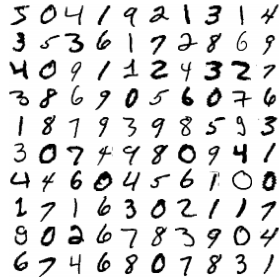
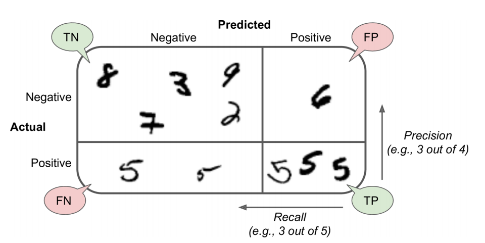
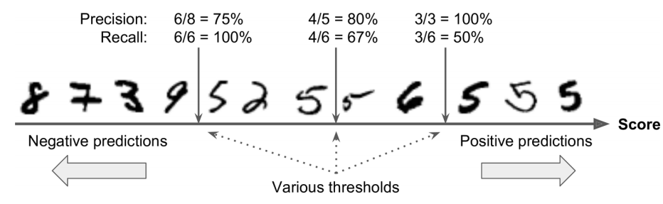



## MNIST (Modified National Institute of Standards and Technology database)

Throughout this chapter, we will use the **MNIST** (Modified National Institute of Standards and Technology) dataset, one of the most widely used benchmark datasets for image classification. It contains **70,000 grayscale images** of handwritten digits (0–9), each with a resolution of **28 × 28 pixels**. Every image is labeled with the digit it represents, making MNIST a supervised multiclass classification problem with ten possible classes.

The dataset was created by combining and preprocessing digit images collected from high school students and employees of the United States Census Bureau. Although MNIST is considered a relatively simple benchmark by modern standards, it remains an excellent dataset for introducing the fundamental concepts of classification, model evaluation, error analysis, and multiclass learning.

Since every image contains 28 × 28 pixels, each instance can be represented as a vector of 784 numerical features. Throughout this chapter, we will use these feature vectors to train, evaluate, and compare different classification algorithms.

```{python}
#| label: load-mnist

from sklearn.datasets import fetch_openml

mnist = fetch_openml(
    "mnist_784",
    as_frame=False,
    parser="auto"
)
```

```{python}
#| label: inspect-mnist

mnist.keys()
```

Datasets loaded with Scikit-Learn are typically returned as a dictionary-like object (a <code>Bunch</code>) that stores both the data and its associated metadata. Although the exact contents depend on the dataset, most of them include the following keys:

- **`DESCR`**: a textual description of the dataset.
- **`data`**: a two-dimensional array containing the feature values, where each row represents an instance and each column corresponds to a feature.
- **`target`**: a one-dimensional array containing the class labels or target values associated with each instance.

Some datasets, such as those downloaded from OpenML, also include additional metadata such as feature names, category information, download details, and the dataset source.

Each row of the feature matrix represents a handwritten digit as a one-dimensional vector of 784 pixel intensities. To visualize one of these images, we first select an instance from the dataset and then reshape its feature vector into its original **28 × 28** pixel format.

```{python}
#| label: extract-features-labels

X, y = mnist.data, mnist.target
```

```{python}
#| label: mnist-shape

print("Feature matrix:", X.shape)
print("Target vector:", y.shape)
```

```{python}
#| label: fig-first-mnist-digit
#| fig-cap: "The first handwritten digit in the MNIST dataset."
#| fig-align: center
#| fig-width: 4

import matplotlib.pyplot as plt

some_digit = X[0]
some_digit_image = some_digit.reshape(28, 28)

plt.figure(figsize=(3, 3))
plt.imshow(some_digit_image, cmap="binary")
plt.axis("off")
plt.show()
```

The target labels returned by OpenML are stored as strings. Since most machine learning algorithms in Scikit-Learn expect numerical labels, we convert the target vector to 8-bit unsigned integers (`uint8`). This data type is sufficient because the labels range only from 0 to 9, while also requiring very little memory.

```{python}
#| label: convert-target

import numpy as np

y = y.astype(np.uint8)
```

{#fig-mnist-samples fig-align="center" width="70%"}

Before training a classifier, we separate the dataset into a training set and a test set. The original MNIST dataset provided by OpenML is already organized so that the first 60,000 images correspond to the training set, while the remaining 10,000 images form the test set. This predefined split has become the standard benchmark used to compare the performance of classification algorithms.

```{python}
#| label: split-mnist

X_train, X_test = X[:60000], X[60000:]
y_train, y_test = y[:60000], y[60000:]
```

## Training a Binary Classifier

To introduce the basic concepts of classification, we will begin with a simpler task: identifying a single digit. Specifically, we will train a model to recognize the digit **5** while treating all other digits as a single alternative class.

This type of problem is known as **binary classification**, since the model must decide between only two possible classes: **5** and **not 5**. Despite its simplicity, binary classification introduces many of the core concepts that also apply to more complex multiclass classification problems.

```{python}
#| label: create-binary-target

y_train_5 = (y_train == 5)
y_test_5 = (y_test == 5)
```

The expressions `y_train == 5` and `y_test == 5` perform an element-wise comparison, producing Boolean arrays. Each element is `True` if the corresponding image represents the digit **5**, and `False` otherwise. These Boolean arrays become the target labels used to train the binary classifier.

To build our first binary classifier, we will use Scikit-Learn's `SGDClassifier`. This classifier implements **Stochastic Gradient Descent (SGD)**, an optimization algorithm that updates the model parameters incrementally by processing one training instance (or a small batch) at a time. Because of its computational efficiency, SGD is particularly well suited for large datasets such as MNIST.

The classifier is initialized with a fixed random seed (`random_state=42`) to ensure that the results are reproducible.

```{python}
#| label: train-sgd

from sklearn.linear_model import SGDClassifier

sgd_clf = SGDClassifier(random_state=42)
sgd_clf.fit(X_train, y_train_5)
```

After training, we can use the classifier to predict whether a new image represents the digit **5**. As a first example, we classify the digit selected earlier in the chapter (`some_digit`).

```{python}
#| label: predict-first-digit

prediction = sgd_clf.predict([some_digit])

print("Prediction:", prediction[0])
print("Actual label:", y[0] == 5)
```

The `predict()` method returns a Boolean value because this is a binary classification problem. A prediction of `True` indicates that the classifier believes the image represents the digit **5**, whereas `False` indicates that it belongs to the **not 5** class.

In this example, the prediction matches the true label, indicating that the classifier correctly identified the handwritten digit.

## Performance Measures

Training a classifier is only the first step in the machine learning workflow. Equally important is evaluating how well the model performs on unseen data. A model that achieves excellent results on the training set may still generalize poorly if it has learned patterns that do not extend beyond the training data.

### Measuring Accuracy Using Cross-Validation

One of the most widely used techniques for estimating a model's predictive performance is **cross-validation**. Rather than relying on a single train-test split, cross-validation repeatedly partitions the training data into different subsets, allowing the model to be trained and evaluated multiple times. This process produces a more reliable estimate of its ability to generalize to new data.

To better understand how cross-validation works, we will implement a simple three-fold stratified cross-validation procedure manually. Although Scikit-Learn provides functions that perform this process automatically, examining the individual steps helps illustrate how the model is repeatedly trained and evaluated on different subsets of the data.

We use **stratified sampling**, which ensures that each fold preserves approximately the same proportion of positive and negative examples as the complete training set. Since the digit **5** represents only a small fraction of the MNIST dataset, stratification produces more representative training and validation subsets.

```{python}
#| label: manual-cross-validation

from sklearn.base import clone
from sklearn.model_selection import StratifiedKFold

skfolds = StratifiedKFold(
    n_splits=3,
    shuffle=True,
    random_state=42
)

for train_index, test_index in skfolds.split(X_train, y_train_5):

    clone_clf = clone(sgd_clf)

    X_train_folds = X_train[train_index]
    y_train_folds = y_train_5[train_index]

    X_valid_fold = X_train[test_index]
    y_valid_fold = y_train_5[test_index]

    clone_clf.fit(X_train_folds, y_train_folds)

    y_pred = clone_clf.predict(X_valid_fold)

    accuracy = (y_pred == y_valid_fold).mean()

    print(f"Fold accuracy: {accuracy:.4f}")
```

The results obtained so far may appear encouraging, with an accuracy exceeding 90%. However, this value can be misleading. In the MNIST dataset, only about 10% of the images correspond to the digit 5. Consequently, a trivial classifier that always predicts “not 5” would achieve an accuracy close to 90%, despite never correctly identifying a single image of the target class.

This example highlights one of the main limitations of accuracy as an evaluation metric. When the class distribution is unbalanced, a classifier may obtain a high accuracy simply by favoring the majority class, without actually learning to recognize the minority class. Such datasets are known as imbalanced (or skewed) datasets, and they require performance measures that better reflect the classifier’s ability to distinguish between positive and negative instances.

For this reason, the following sections introduce additional evaluation metrics—including the confusion matrix, precision, recall, and the F1-score—which provide a more informative assessment of classifier performance in imbalanced classification problems.

During each iteration, one fold is temporarily held out as the validation set, while the remaining two folds are used to train the classifier. This process is repeated three times so that every observation serves as validation data exactly once.

The reported accuracies correspond to the classifier's performance on each validation fold. Because the model is retrained from scratch during every iteration, these values provide a more reliable estimate of its ability to generalize than evaluating it on the training data alone.

```{dot}
//| echo: false
//| label: fig-cross-validation
//| fig-cap: "Three-fold stratified cross-validation. In each iteration, two folds are used for training and the remaining fold is used for validation."
//| fig-align: center

digraph cross_validation {

    graph [
        rankdir=TB,
        bgcolor="transparent",
        nodesep=0.18,
        ranksep=0.45,
        pad=0.2
    ];

    node [
        shape=box,
        style="rounded,filled",
        fontname="Arial",
        fontsize=11,
        width=1.65,
        height=0.55,
        margin="0.12,0.08"
    ];

    edge [
        style=invis
    ];

    subgraph cluster_iteration1 {
        label="Iteration 1";
        fontname="Arial Bold";
        fontsize=12;
        style="rounded";
        color="#888888";

        A1 [label="Fold 1\nTraining", fillcolor="#DCEEFF", color="#4A78A8"];
        A2 [label="Fold 2\nTraining", fillcolor="#DCEEFF", color="#4A78A8"];
        A3 [label="Fold 3\nValidation", fillcolor="#F8D7DA", color="#A94442"];

        { rank=same; A1; A2; A3; }
        A1 -> A2 -> A3;
    }

    subgraph cluster_iteration2 {
        label="Iteration 2";
        fontname="Arial Bold";
        fontsize=12;
        style="rounded";
        color="#888888";

        B1 [label="Fold 1\nTraining", fillcolor="#DCEEFF", color="#4A78A8"];
        B2 [label="Fold 2\nValidation", fillcolor="#F8D7DA", color="#A94442"];
        B3 [label="Fold 3\nTraining", fillcolor="#DCEEFF", color="#4A78A8"];

        { rank=same; B1; B2; B3; }
        B1 -> B2 -> B3;
    }

    subgraph cluster_iteration3 {
        label="Iteration 3";
        fontname="Arial Bold";
        fontsize=12;
        style="rounded";
        color="#888888";

        C1 [label="Fold 1\nValidation", fillcolor="#F8D7DA", color="#A94442"];
        C2 [label="Fold 2\nTraining", fillcolor="#DCEEFF", color="#4A78A8"];
        C3 [label="Fold 3\nTraining", fillcolor="#DCEEFF", color="#4A78A8"];

        { rank=same; C1; C2; C3; }
        C1 -> C2 -> C3;
    }

    A1 -> B1;
    B1 -> C1;
}
```

As shown in @fig-cross-validation, each fold is used once as the validation set and twice as part of the training set.

### Confusion Matrix

In the previous section, we observed that a classifier can achieve an accuracy greater than **90%** while still performing poorly on the class of interest. This example illustrates that **accuracy alone is often insufficient to evaluate a classification model**, particularly when the classes are imbalanced.

A much more informative evaluation tool is the **confusion matrix**, which summarizes how the predicted classes compare with the true classes. Rather than reporting a single overall metric, the confusion matrix reveals **which types of errors** the classifier is making.

For a classification problem with $K$ classes, the confusion matrix is a $K \times K$ table. Each **row** corresponds to the actual class, while each **column** corresponds to the predicted class. Consequently, the element located in row $i$ and column $j$ represents the number of observations that truly belong to class $i$ but were classified as class $j$.

For example, if we considered the complete MNIST problem, the value located in the fifth row and the third column would indicate the number of images of the digit **5** that were incorrectly classified as **3**. Correct predictions appear along the main diagonal of the matrix, whereas the off-diagonal elements correspond to classification errors.

Before computing the confusion matrix, we need one prediction for every observation in the training set. Although these predictions could be generated using the test set, doing so would compromise its role as an independent dataset for the final evaluation of the model. Instead, we generate **cross-validated predictions** using `cross_val_predict()`.

Unlike `cross_val_score()`, which returns only the evaluation score for each fold, `cross_val_predict()` returns the prediction associated with every observation. During the cross-validation procedure, each observation is predicted by a model that **was not trained using that observation**, providing an unbiased estimate of the classifier's performance on unseen data.

```{python}
#| label: cross-validated-predictions

from sklearn.model_selection import cross_val_predict

y_train_pred = cross_val_predict(
    sgd_clf,
    X_train,
    y_train_5,
    cv=3
)
```

Once these predictions have been generated, the confusion matrix can be obtained by comparing the predicted labels with the true labels.

```{python}
#| label: binary-confusion-matrix

from sklearn.metrics import confusion_matrix

cm = confusion_matrix(
    y_train_5,
    y_train_pred
)

cm
```

The confusion matrix for a binary classification problem has the following general structure.

```{dot}
//| echo: false
//| label: fig-binary-confusion-matrix
//| fig-cap: "General structure of a binary confusion matrix."
//| fig-align: center

digraph confusion {

graph[
    bgcolor="transparent",
    ranksep=0.15,
    nodesep=0.05
];

node[
    shape=box,
    style="rounded,filled",
    fontname="Arial",
    fontsize=11
];

a[label="",style=invis];

b[label="Predicted\nNegative",fillcolor="#EAF2F8"];
c[label="Predicted\nPositive",fillcolor="#EAF2F8"];

d[label="Actual\nNegative",fillcolor="#EAF2F8"];
e[label="True\nNegative\n(TN)",fillcolor="#E8F5E9"];
f[label="False\nPositive\n(FP)",fillcolor="#FDEDEC"];

g[label="Actual\nPositive",fillcolor="#EAF2F8"];
h[label="False\nNegative\n(FN)",fillcolor="#FDEDEC"];
i[label="True\nPositive\n(TP)",fillcolor="#E8F5E9"];

{rank=same;a;b;c;}
{rank=same;d;e;f;}
{rank=same;g;h;i;}

a->b->c[style=invis];
d->e->f[style=invis];
g->h->i[style=invis];
a->d->g[style=invis];
b->e->h[style=invis];
c->f->i[style=invis];

}
```

As illustrated in @fig-binary-confusion-matrix, the rows correspond to the **actual classes**, while the columns correspond to the **predicted classes**. Consequently,

- **True Negatives (TN):** negative observations correctly classified as negative.
- **False Positives (FP):** negative observations incorrectly classified as positive.
- **False Negatives (FN):** positive observations incorrectly classified as negative.
- **True Positives (TP):** positive observations correctly classified as positive.

For our binary classifier, the confusion matrix can be interpreted as follows:

- The **first row** corresponds to images that are **not** the digit **5**. Most of these images were correctly classified as negative (**True Negatives**), while a much smaller number were incorrectly classified as **5** (**False Positives**).

- The **second row** corresponds to images that actually represent the digit **5**. Some of them were incorrectly classified as non-5 (**False Negatives**), whereas the remaining images were correctly identified as **5** (**True Positives**).

The four quantities that summarize the confusion matrix can be extracted directly.

```{python}
#| label: unpack-confusion-matrix

tn, fp, fn, tp = cm.ravel()

print(f"True Negatives : {tn}")
print(f"False Positives: {fp}")
print(f"False Negatives: {fn}")
print(f"True Positives : {tp}")
```

A perfect classifier would correctly classify every observation. In that case, the confusion matrix would contain nonzero values only along its main diagonal.

```{python}
#| label: perfect-confusion-matrix

y_train_perfect_predictions = y_train_5

confusion_matrix(
    y_train_5,
    y_train_perfect_predictions
)
```

The confusion matrix provides a complete summary of the classifier's predictions. However, comparing several models directly from the four cell counts is often inconvenient. For this reason, a number of evaluation metrics are derived from these quantities. The most commonly used are **precision**, **recall**, and the **F1-score**, which are introduced in the following sections.

### Precision and Recall

The confusion matrix provides a detailed summary of a classifier's predictions, but comparing models directly from its four cell counts is often inconvenient. For this reason, several evaluation metrics are derived from the quantities **TP**, **FP**, **TN**, and **FN**. Among the most widely used are **precision** and **recall**, each capturing a different aspect of classification performance.

Although both metrics focus on the positive class, they answer fundamentally different questions. Understanding this distinction is essential because different applications may require optimizing one metric over the other.

#### Precision

Precision measures the reliability of the positive predictions made by a classifier. It answers the following question:

> **Among all observations predicted as positive, what proportion actually belongs to the positive class?**

Mathematically, precision is defined as

$$
\text{Precision}
=
\frac{TP}{TP+FP},
$$

where:

- $TP$ is the number of **True Positives**.
- $FP$ is the number of **False Positives**.

A classifier with high precision generates relatively few false alarms. Consequently, precision is particularly important in applications where **false positives are expensive or undesirable**.

Using the predictions generated in the previous section, precision can be computed directly with Scikit-Learn.

```{python}
#| label: precision-score

from sklearn.metrics import precision_score

precision = precision_score(
    y_train_5,
    y_train_pred
)

print(f"Precision: {precision:.4f}")
```

The same quantity can also be verified directly from the confusion matrix.

```{python}
#| label: manual-precision

precision_manual = tp / (tp + fp)

print(f"Manual precision: {precision_manual:.4f}")
```

#### Recall

Recall evaluates a different property of the classifier. Instead of measuring how reliable positive predictions are, it measures **how many of the actual positive observations the classifier successfully identifies**.

In other words, recall answers the question:

> **Among all truly positive observations, what proportion was correctly detected by the classifier?**

Recall is defined as

$$
\text{Recall}
=
\frac{TP}{TP+FN},
$$

where $FN$ denotes the number of **False Negatives**.

Recall is also known as **Sensitivity** or the **True Positive Rate (TPR)**.

It can be computed as follows.

```{python}
#| label: recall-score

from sklearn.metrics import recall_score

recall = recall_score(
    y_train_5,
    y_train_pred
)

print(f"Recall: {recall:.4f}")
```

Again, the result can be verified directly from the confusion matrix.

```{python}
#| label: manual-recall

recall_manual = tp / (tp + fn)

print(f"Manual recall: {recall_manual:.4f}")
```

#### Comparing Precision and Recall

Although both metrics evaluate the positive class, they measure different characteristics of a classifier.

- **Precision** evaluates the reliability of positive predictions.
- **Recall** evaluates the ability to identify all positive observations.

Depending on the application, one metric may be substantially more important than the other.

For example:

- In **email spam detection**, incorrectly classifying a legitimate email as spam can be highly undesirable. In this case, high **precision** is often preferred.
- In **medical screening**, failing to identify a patient with a disease may have serious consequences. Here, maximizing **recall** is usually more important.

Because these objectives often conflict, improving one metric frequently decreases the other. This phenomenon is known as the **precision–recall trade-off**, which we will study in the next section.

{#fig-confusion-matrix fig-align="center" width="80%"}

#### The F1-score

In many situations it is convenient to summarize precision and recall using a single metric. The **F1-score** combines both quantities through their **harmonic mean**.

Unlike the arithmetic mean, the harmonic mean penalizes large differences between its components. Consequently, the F1-score is high only when **both precision and recall are high**.

The F1-score is defined as

$$
F_1
=
2
\cdot
\frac{\text{Precision}\times\text{Recall}}
{\text{Precision}+\text{Recall}}.
$$

Substituting the definitions of precision and recall yields the equivalent expression

$$
F_1
=
\frac{2TP}{2TP+FP+FN}.
$$

Scikit-Learn computes the F1-score using the `f1_score()` function.

```{python}
#| label: f1-score

from sklearn.metrics import f1_score

f1 = f1_score(
    y_train_5,
    y_train_pred
)

print(f"F1-score: {f1:.4f}")
```

The F1-score is particularly useful when comparing several classifiers because it summarizes two complementary aspects of performance into a single value. However, it should not replace precision and recall when the application assigns different importance to false positives and false negatives.

::: {.callout-note title="Key takeaway"}

- **Precision** answers *"When the classifier predicts positive, how often is it correct?"*
- **Recall** answers *"Among all positive observations, how many were detected?"*
- **F1-score** summarizes both metrics and is highest only when precision and recall are simultaneously high.

:::

### Precision–Recall Trade-off

In the previous section, we introduced **precision** and **recall** as two complementary measures of classification performance. In practice, however, these metrics are rarely optimized simultaneously. Improving one often comes at the expense of the other, a phenomenon known as the **precision–recall trade-off**.

Understanding this trade-off requires examining how a classifier makes its decisions.

#### Decision Scores and Classification Thresholds

Many classification algorithms do not directly predict a class label. Instead, they first compute a **decision score**, which measures how strongly an observation belongs to the positive class. The final prediction is then obtained by comparing this score with a predefined **decision threshold**.

For the `SGDClassifier`, this process can be summarized as follows:

- If the decision score is **greater than or equal to the threshold**, the observation is classified as **positive**.
- Otherwise, it is classified as **negative**.

By default, the threshold used by `SGDClassifier` is **zero**. However, this value is not necessarily optimal for every application.

Figure @fig-decision-threshold illustrates this decision process. Observations are ordered according to their decision scores, and the threshold determines which observations are assigned to the positive class.

{#fig-decision-threshold fig-align="center" width="80%"}

A **lower threshold** classifies more observations as positive. As a result, the classifier tends to identify a larger proportion of the actual positive observations, increasing **recall**. However, this also increases the number of false positives, which generally reduces **precision**.

Conversely, a **higher threshold** makes the classifier more conservative. Fewer observations are predicted as positive, reducing the number of false positives and typically increasing **precision**. At the same time, more positive observations are missed, causing **recall** to decrease.

This behavior explains why precision and recall usually move in opposite directions. Choosing an appropriate threshold therefore depends on the specific objectives of the application rather than on a universal rule.

Although Scikit-Learn does not allow the classification threshold to be modified directly through the `predict()` method, it provides access to the underlying decision scores through the `decision_function()` method. These scores can then be combined with any threshold selected by the user.

```{python}
#| label: decision-score-example

y_score = sgd_clf.decision_function([some_digit])

print(f"Decision score: {y_score[0]:.2f}")
```

A prediction equivalent to the default behavior of `predict()` is obtained by comparing the score with a threshold equal to zero.

```{python}
#| label: default-threshold-prediction

threshold = 0

(y_score >= threshold)
```

Suppose that a more conservative classifier is desired. Increasing the threshold changes the prediction rule.

```{python}
#| label: higher-threshold-prediction

threshold = 8000

(y_score >= threshold)
```

Notice that the same observation may change from a positive prediction to a negative prediction simply because the threshold has changed. The classifier itself has **not** been retrained; only the decision rule has been modified.

This simple example illustrates an important principle in classification: **the prediction depends not only on the model, but also on the decision threshold used to convert scores into class labels**.

In the next section, we will evaluate the classifier over **all possible threshold values** by constructing the **Precision–Recall curve**, which provides a comprehensive view of the trade-off between these two metrics.

#### Selecting a Classification Threshold

Once the classifier's decision scores are available, the next question is:

> **Which threshold should be used to convert these scores into class predictions?**

There is no universally optimal threshold. The appropriate value depends on the relative importance of **false positives** and **false negatives** in the application.

For example, a medical screening system may prioritize recall because failing to detect a patient with a disease could be especially costly. In contrast, a system that automatically blocks financial transactions may require high precision to avoid incorrectly rejecting legitimate operations.

To analyze the behavior of the classifier across many possible thresholds, we first need decision scores for every observation in the training set.

Instead of generating class predictions with `cross_val_predict()`, we specify `method="decision_function"` so that the function returns the out-of-fold decision score assigned to each observation.

```{python}
#| label: cross-validated-decision-scores

from sklearn.model_selection import cross_val_predict

y_scores = cross_val_predict(
    sgd_clf,
    X_train,
    y_train_5,
    cv=3,
    method="decision_function",
    n_jobs=-1
)
```

Each score is generated for an observation that was not used to train the corresponding model. This provides a more realistic basis for studying threshold behavior than computing scores directly from a model evaluated on its own training observations.

However, these cross-validated predictions should not be interpreted as a complete estimate of model generalization in every setting. Scikit-Learn notes that results obtained from `cross_val_predict()` may differ from those produced by `cross_validate()` or `cross_val_score()`, particularly when fold sizes differ or the evaluation metric does not decompose over individual observations.

#### Computing Precision and Recall Across Thresholds

The `precision_recall_curve()` function computes precision and recall values for the decision thresholds induced by the classifier scores.

```{python}
#| label: compute-precision-recall-curve

from sklearn.metrics import precision_recall_curve

precisions, recalls, thresholds = precision_recall_curve(
    y_train_5,
    y_scores
)
```

The returned arrays do not have exactly the same length:

```{python}
#| label: precision-recall-array-lengths

print(f"Number of precision values: {len(precisions)}")
print(f"Number of recall values: {len(recalls)}")
print(f"Number of thresholds: {len(thresholds)}")
```

Both `precisions` and `recalls` contain one more element than `thresholds`. The final precision and recall values represent the endpoint of the curve and do not correspond to a classification threshold.

Therefore, when plotting precision and recall against thresholds, the final element of each metric array must be excluded.

#### Precision and Recall as Functions of the Threshold

The following function plots both metrics across the available classification thresholds.

```{python}
#| label: plot-precision-recall-vs-threshold
#| fig-cap: "Precision and recall as functions of the classification threshold."
#| fig-width: 8
#| fig-height: 5
#| code-fold: true
#| code-summary: "Show code"

import matplotlib.pyplot as plt

def plot_precision_recall_vs_threshold(
    precisions,
    recalls,
    thresholds
):
    fig, ax = plt.subplots(figsize=(8, 5))

    ax.plot(
        thresholds,
        precisions[:-1],
        linestyle="--",
        linewidth=2,
        label="Precision"
    )

    ax.plot(
        thresholds,
        recalls[:-1],
        linewidth=2,
        label="Recall"
    )

    ax.set_xlabel("Decision threshold")
    ax.set_ylabel("Score")
    ax.set_ylim(0, 1.05)
    ax.grid(alpha=0.3)
    ax.legend()

    plt.show()


plot_precision_recall_vs_threshold(
    precisions,
    recalls,
    thresholds
)
```

As the threshold increases, the classifier becomes more conservative about assigning observations to the positive class.

In general:

- **Recall decreases** because fewer observations are classified as positive, causing more actual positives to be missed.
- **Precision tends to increase** because the remaining positive predictions are based on stronger decision scores.

Precision is not necessarily perfectly monotonic. Increasing the threshold can occasionally remove a true positive before removing a false positive, producing small downward fluctuations. Recall, in contrast, decreases monotonically as the threshold increases.

The graph allows us to inspect the relationship between the threshold and the resulting metric values. However, selecting a threshold should be based on a performance requirement established by the application, not merely on the visual appearance of the curves.

#### The Precision–Recall Curve

Another useful representation plots precision directly against recall.

This curve removes the threshold from the horizontal axis and displays the combinations of precision and recall that can be achieved by changing the classification threshold.

```{python}
#| label: plot-precision-vs-recall
#| fig-cap: "Precision–Recall curve for the binary classifier."
#| fig-width: 7
#| fig-height: 6
#| #| code-fold: true
#| code-summary: "Show code"

def plot_precision_vs_recall(
    precisions,
    recalls
):
    fig, ax = plt.subplots(figsize=(7, 6))

    ax.plot(
        recalls,
        precisions,
        linewidth=2
    )

    ax.set_xlabel("Recall")
    ax.set_ylabel("Precision")
    ax.set_xlim(0, 1.01)
    ax.set_ylim(0, 1.01)
    ax.grid(alpha=0.3)

    plt.show()


plot_precision_vs_recall(
    precisions,
    recalls
)
```

Each point on the curve corresponds to a different classification threshold. Moving along the curve illustrates how gaining recall usually requires accepting lower precision, and vice versa.

An ideal classifier would remain close to the upper-right corner, where both precision and recall are high. In practice, the curve helps identify regions where one metric begins to deteriorate rapidly as the other improves.

#### Selecting a Threshold for a Target Precision

Suppose that the application requires the classifier to achieve a precision of at least $90\%$.

Rather than estimating the threshold visually from the graph, we can identify the first threshold whose associated precision reaches the desired level.

```{python}
#| label: select-threshold-for-target-precision

import numpy as np

target_precision = 0.90

valid_indices = np.flatnonzero(
    precisions[:-1] >= target_precision
)

if len(valid_indices) == 0:
    raise ValueError(
        "The requested precision cannot be achieved "
        "with the available thresholds."
    )

threshold_index = valid_indices[0]
threshold_90_precision = thresholds[threshold_index]

print(
    "Threshold for at least "
    f"{target_precision:.0%} precision: "
    f"{threshold_90_precision:.2f}"
)
```

Using `precisions[:-1]` is important because the final precision value returned by `precision_recall_curve()` does not have a corresponding threshold.

The selected threshold is the **lowest observed threshold** at which the estimated precision reaches at least $90\%$. Selecting the lowest qualifying threshold is sensible because, among the thresholds that satisfy the precision requirement, it generally preserves as much recall as possible.

We can inspect the precision and recall associated with this threshold.

```{python}
#| label: metrics-at-selected-threshold

precision_at_threshold = precisions[threshold_index]
recall_at_threshold = recalls[threshold_index]

print(
    f"Precision at selected threshold: "
    f"{precision_at_threshold:.4f}"
)

print(
    f"Recall at selected threshold: "
    f"{recall_at_threshold:.4f}"
)
```

#### Visualizing the Selected Threshold

The selected operating point can be added to both graphs.

```{python}
#| label: plot-selected-threshold
#| fig-cap: "Precision and recall with the selected threshold for a target precision of 90%."
#| fig-width: 8
#| fig-height: 5
#| code-fold: true
#| code-summary: "Show code"

def plot_metrics_with_selected_threshold(
    precisions,
    recalls,
    thresholds,
    threshold_index
):
    selected_threshold = thresholds[threshold_index]
    selected_precision = precisions[threshold_index]
    selected_recall = recalls[threshold_index]

    fig, ax = plt.subplots(figsize=(8, 5))

    ax.plot(
        thresholds,
        precisions[:-1],
        linestyle="--",
        linewidth=2,
        label="Precision"
    )

    ax.plot(
        thresholds,
        recalls[:-1],
        linewidth=2,
        label="Recall"
    )

    ax.axvline(
        selected_threshold,
        linestyle=":",
        linewidth=2,
        label=(
            f"Selected threshold = "
            f"{selected_threshold:.0f}"
        )
    )

    ax.scatter(
        [selected_threshold],
        [selected_precision],
        s=60
    )

    ax.scatter(
        [selected_threshold],
        [selected_recall],
        s=60
    )

    ax.set_xlabel("Decision threshold")
    ax.set_ylabel("Score")
    ax.set_ylim(0, 1.05)
    ax.grid(alpha=0.3)
    ax.legend()

    plt.show()


plot_metrics_with_selected_threshold(
    precisions,
    recalls,
    thresholds,
    threshold_index
)
```

The corresponding point can also be highlighted on the Precision–Recall curve.

```{python}
#| label: plot-selected-precision-recall-point
#| fig-cap: "Selected operating point on the Precision–Recall curve."
#| fig-width: 7
#| fig-height: 6
#| code-fold: true
#| code-summary: "Show code"

def plot_precision_recall_with_selected_point(
    precisions,
    recalls,
    threshold_index
):
    selected_precision = precisions[threshold_index]
    selected_recall = recalls[threshold_index]

    fig, ax = plt.subplots(figsize=(7, 6))

    ax.plot(
        recalls,
        precisions,
        linewidth=2,
        label="Precision–Recall curve"
    )

    ax.scatter(
        selected_recall,
        selected_precision,
        s=80,
        label=(
            f"Precision = {selected_precision:.2f}, "
            f"Recall = {selected_recall:.2f}"
        )
    )

    ax.annotate(
        (
            f"({selected_recall:.2f}, "
            f"{selected_precision:.2f})"
        ),
        xy=(
            selected_recall,
            selected_precision
        ),
        xytext=(
            max(selected_recall - 0.25, 0.05),
            max(selected_precision - 0.15, 0.05)
        ),
        arrowprops={
            "arrowstyle": "->",
            "linewidth": 1.2
        }
    )

    ax.set_xlabel("Recall")
    ax.set_ylabel("Precision")
    ax.set_xlim(0, 1.01)
    ax.set_ylim(0, 1.01)
    ax.grid(alpha=0.3)
    ax.legend()

    plt.show()


plot_precision_recall_with_selected_point(
    precisions,
    recalls,
    threshold_index
)
```

#### Generating Predictions With the Selected Threshold

Once the threshold has been selected, class predictions can be obtained by comparing each decision score with that threshold.

```{python}
#| label: predictions-at-selected-threshold

y_train_pred_90 = (
    y_scores >= threshold_90_precision
)
```

We can then compute the resulting precision and recall.

```{python}
#| label: evaluate-selected-threshold

from sklearn.metrics import precision_score, recall_score

precision_90 = precision_score(
    y_train_5,
    y_train_pred_90
)

recall_90 = recall_score(
    y_train_5,
    y_train_pred_90
)

print(f"Precision: {precision_90:.4f}")
print(f"Recall: {recall_90:.4f}")
```

The resulting precision should be at least $90\%$, subject to the discrete set of scores observed in the cross-validated predictions. The corresponding recall shows the proportion of actual positive observations retained after imposing the stricter classification requirement.

::: {.callout-warning title="Do not select and evaluate the threshold on the same data"}

The preceding analysis is useful for understanding the precision–recall trade-off. However, the reported performance should not be treated as an unbiased estimate of future performance if the same cross-validated scores are used both to select the threshold and to report its final metrics.

A more rigorous workflow is:

1. Use the training or validation data to select the threshold.
2. Fix that threshold.
3. Evaluate the resulting classifier once on an independent test set.

The test set should not influence either model training or threshold selection.

:::

::: {.callout-note title="Threshold selection is a decision problem"}

A classification threshold should not be selected because it produces a visually attractive graph or because $0.5$ or $0$ is the software default.

It should reflect:

- the operational cost of false positives;
- the operational cost of false negatives;
- the required minimum precision or recall;
- the prevalence of the positive class;
- the capacity available to review or act on positive predictions.

The threshold is therefore part of the deployed decision system, not merely a technical detail of the classifier.

:::

### The ROC Curve

The **Receiver Operating Characteristic**, or **ROC curve**, is another widely used tool for evaluating binary classifiers across different classification thresholds.

Like the Precision–Recall curve, the ROC curve is constructed from the classifier's decision scores rather than from predictions generated at a single fixed threshold. However, it represents a different trade-off.

The ROC curve plots:

- the **True Positive Rate** on the vertical axis;
- the **False Positive Rate** on the horizontal axis.

#### True Positive Rate

The **True Positive Rate**, abbreviated as **TPR**, is the proportion of actual positive observations that are correctly classified as positive.

It is defined as

$$
\operatorname{TPR}
=
\frac{TP}{TP+FN}.
$$

The TPR is equivalent to **recall** and is also known as **sensitivity**.

#### False Positive Rate

The **False Positive Rate**, abbreviated as **FPR**, is the proportion of actual negative observations that are incorrectly classified as positive.

It is defined as

$$
\operatorname{FPR}
=
\frac{FP}{FP+TN}.
$$

The complement of the False Positive Rate is the **True Negative Rate**:

$$
\operatorname{TNR}
=
\frac{TN}{TN+FP}.
$$

The TNR is also known as **specificity**. Therefore,

$$
\operatorname{FPR}
=
1-\operatorname{specificity}.
$$

Consequently, the ROC curve can also be described as a plot of

$$
\text{Sensitivity}
\quad\text{versus}\quad
1-\text{Specificity}.
$$

#### How the ROC Curve Is Constructed

For each possible decision threshold, the classifier generates a different pair of values:

$$
(\operatorname{FPR}, \operatorname{TPR}).
$$

A very high threshold produces few positive predictions. Both the TPR and FPR will therefore tend to be low.

As the threshold decreases, more observations are classified as positive:

- the classifier detects more true positives, increasing the TPR;
- it also tends to generate more false positives, increasing the FPR.

The ROC curve summarizes all these operating points.

Scikit-Learn computes the corresponding false positive rates, true positive rates, and thresholds using `roc_curve()`.

```{python}
#| label: compute-roc-curve

from sklearn.metrics import roc_curve

fpr, tpr, roc_thresholds = roc_curve(
    y_train_5,
    y_scores
)
```

The `y_scores` array may contain either non-thresholded decision values or estimated probabilities for the positive class. In this example, it contains the out-of-fold decision scores generated previously with `cross_val_predict()`. Scikit-Learn's `roc_curve()` is designed for binary classification and returns one FPR and TPR value for each retained decision threshold.  [oai_citation:0‡Scikit-learn](https://scikit-learn.org/stable/modules/generated/sklearn.metrics.roc_curve.html)

#### Plotting the ROC Curve

```{python}
#| label: plot-roc-curve
#| fig-cap: "ROC curve for the SGD classifier."
#| fig-width: 7
#| fig-height: 6
#| code-fold: true
#| code-summary: "Show code"

import matplotlib.pyplot as plt

def plot_roc_curve(
    fpr,
    tpr,
    label=None
):
    fig, ax = plt.subplots(figsize=(7, 6))

    ax.plot(
        fpr,
        tpr,
        linewidth=2,
        label=label
    )

    ax.plot(
        [0, 1],
        [0, 1],
        linestyle="--",
        linewidth=1.5,
        label="Random classifier"
    )

    ax.set_xlabel("False Positive Rate")
    ax.set_ylabel("True Positive Rate")
    ax.set_xlim(0, 1)
    ax.set_ylim(0, 1.01)
    ax.grid(alpha=0.3)

    if label is not None:
        ax.legend(loc="lower right")

    plt.show()


plot_roc_curve(
    fpr,
    tpr,
    label="SGD classifier"
)
```

The diagonal line represents the expected behavior of a classifier that ranks observations randomly.

A useful ROC curve rises rapidly toward the upper-left corner. This region represents classifiers that achieve:

- a high True Positive Rate;
- a low False Positive Rate.

The ideal operating point would be

$$
(\operatorname{FPR},\operatorname{TPR})=(0,1),
$$

meaning that all positive observations are detected without incorrectly classifying any negative observations as positive.

#### Interpreting Points on the ROC Curve

Each point on the ROC curve corresponds to a different classification threshold.

Moving toward the upper-right part of the curve generally means lowering the threshold. This causes the classifier to identify more positive observations, but also to misclassify more negative observations as positive.

Therefore, the ROC curve represents a trade-off between:

- correctly identifying positive observations;
- incorrectly flagging negative observations.

The curve does not determine which threshold should be selected. That choice still depends on the operational consequences of false positives and false negatives.

#### Area Under the ROC Curve

A common way to summarize the ROC curve is through the **Area Under the Curve**, abbreviated as **ROC AUC**.

The ROC AUC produces a single value between 0 and 1:

- an AUC of $1$ corresponds to perfect ranking;
- an AUC of approximately $0.5$ corresponds to random ranking;
- an AUC below $0.5$ indicates that the ranking is systematically worse than random under the specified positive-class orientation.

The ROC AUC for the SGD classifier can be computed as follows.

```{python}
#| label: compute-sgd-roc-auc

from sklearn.metrics import roc_auc_score

sgd_roc_auc = roc_auc_score(
    y_train_5,
    y_scores
)

print(f"SGD ROC AUC: {sgd_roc_auc:.4f}")
```

For binary classification, `roc_auc_score()` accepts either estimated probabilities for the positive class or non-thresholded decision values, such as those returned by `decision_function()`.  [oai_citation:1‡Scikit-learn](https://scikit-learn.org/stable/modules/generated/sklearn.metrics.roc_auc_score.html)

#### Probabilistic Interpretation of ROC AUC

The ROC AUC can be interpreted as the probability that the classifier assigns a higher score to a randomly selected positive observation than to a randomly selected negative observation.

Therefore, ROC AUC primarily measures the classifier's **ranking ability**.

This interpretation is important because the ROC AUC does not evaluate the classifier at one specific threshold. Two models can have similar ROC AUC values but behave differently at the operating region that matters for a particular application.

::: {.callout-warning title="ROC AUC does not select the operating threshold"}

A high ROC AUC does not guarantee that the classifier will have high precision, recall, or accuracy at the threshold used in practice.

ROC AUC evaluates performance over all thresholds. After comparing models, a threshold must still be selected according to the application's requirements.

:::

#### ROC Curve or Precision–Recall Curve?

The ROC and Precision–Recall curves evaluate different aspects of classifier behavior.

The ROC curve compares:

$$
\operatorname{TPR}
\quad\text{against}\quad
\operatorname{FPR}.
$$

The Precision–Recall curve compares:

$$
\operatorname{Precision}
\quad\text{against}\quad
\operatorname{Recall}.
$$

A practical guideline is:

- use the **Precision–Recall curve** when the positive class is rare or when false positives are especially important;
- use the **ROC curve** when both classes are sufficiently represented and the trade-off between sensitivity and specificity is central to the application.

The distinction is especially relevant in imbalanced datasets. The FPR divides the number of false positives by the total number of negative observations:

$$
\operatorname{FPR}
=
\frac{FP}{FP+TN}.
$$

When the negative class is very large, a classifier may produce many false positives while still obtaining a relatively small FPR. As a result, the ROC curve can appear optimistic even when the precision of the positive predictions is limited.

In the MNIST binary problem, the positive class consists only of images representing the digit $5$, whereas the negative class contains all other digits. Because the negative class is much larger, the Precision–Recall curve provides a particularly informative view of the model's performance on the positive class.

::: {.callout-tip title="Practical recommendation"}

Do not choose between ROC and Precision–Recall curves mechanically.

Use the curve that best reflects the decision problem:

- **ROC:** How much sensitivity can be achieved for a tolerated false positive rate?
- **Precision–Recall:** How reliable are the positive predictions while maintaining an acceptable detection rate?

In strongly imbalanced problems, it is often useful to report both curves, while giving greater attention to the Precision–Recall curve.

:::

#### Comparing the SGD Classifier With a Random Forest

We can now train a `RandomForestClassifier` and compare its ROC curve and ROC AUC with those of the SGD classifier.

Unlike `SGDClassifier`, the random forest provides class probabilities through `predict_proba()`.

```{python}
#| label: random-forest-cross-validated-probabilities

from sklearn.ensemble import RandomForestClassifier
from sklearn.model_selection import cross_val_predict

forest_clf = RandomForestClassifier(
    n_estimators=100,
    random_state=42,
    n_jobs=-1
)

y_probas_forest = cross_val_predict(
    forest_clf,
    X_train,
    y_train_5,
    cv=3,
    method="predict_proba",
    n_jobs=-1
)
```

For binary classification, `predict_proba()` returns one probability for each class.

```{python}
#| label: inspect-random-forest-probabilities

print(y_probas_forest.shape)
print(y_probas_forest[:5])
```

Assuming that the positive class is stored in the second column, its estimated probabilities can be extracted as follows:

```{python}
#| label: extract-positive-class-probabilities

y_scores_forest = y_probas_forest[:, 1]
```

This convention corresponds to the probability of `classes_[1]`, which is the class treated as positive by binary ROC AUC calculations.  [oai_citation:2‡Scikit-learn](https://scikit-learn.org/stable/modules/generated/sklearn.metrics.roc_auc_score.html)

For a reusable workflow, it is preferable to verify the order of the classes after fitting the estimator rather than assuming it silently.

The ROC curve for the random forest can now be computed.

```{python}
#| label: compute-random-forest-roc

fpr_forest, tpr_forest, roc_thresholds_forest = roc_curve(
    y_train_5,
    y_scores_forest
)
```

#### Comparing Both ROC Curves

```{python}
#| label: compare-roc-curves
#| fig-cap: "Comparison of the ROC curves for the SGD classifier and Random Forest."
#| fig-width: 7
#| fig-height: 6
#| code-fold: true
#| code-summary: "Show code"

fig, ax = plt.subplots(figsize=(7, 6))

ax.plot(
    fpr,
    tpr,
    linestyle=":",
    linewidth=2,
    label="SGD classifier"
)

ax.plot(
    fpr_forest,
    tpr_forest,
    linewidth=2,
    label="Random Forest"
)

ax.plot(
    [0, 1],
    [0, 1],
    linestyle="--",
    linewidth=1.5,
    label="Random classifier"
)

ax.set_xlabel("False Positive Rate")
ax.set_ylabel("True Positive Rate")
ax.set_xlim(0, 1)
ax.set_ylim(0, 1.01)
ax.grid(alpha=0.3)
ax.legend(loc="lower right")

plt.show()
```

A curve that lies closer to the upper-left corner generally indicates better ranking performance.

However, the comparison should not rely only on the visual curves. We can compute the ROC AUC of both models.

```{python}
#| label: compare-roc-auc-scores

forest_roc_auc = roc_auc_score(
    y_train_5,
    y_scores_forest
)

print(f"SGD ROC AUC: {sgd_roc_auc:.4f}")
print(f"Random Forest ROC AUC: {forest_roc_auc:.4f}")
```

If the Random Forest obtains a higher ROC AUC, this indicates that it ranks positive observations above negative observations more effectively across the complete range of thresholds.

Nevertheless, this does not yet prove that it is the best model for the intended application. The final comparison should also consider:

- the Precision–Recall curve;
- precision and recall at the selected threshold;
- computational cost;
- model interpretability;
- performance on an independent test set.

#### Comparing Precision–Recall Curves

Because the positive class is relatively rare, it is useful to compare the models using the Precision–Recall curve as well.

```{python}
#| label: random-forest-precision-recall

from sklearn.metrics import precision_recall_curve

precisions_forest, recalls_forest, pr_thresholds_forest = (
    precision_recall_curve(
        y_train_5,
        y_scores_forest
    )
)
```

```{python}
#| label: compare-precision-recall-curves
#| fig-cap: "Comparison of the Precision–Recall curves for the SGD classifier and Random Forest."
#| fig-width: 7
#| fig-height: 6
#| code-fold: true
#| code-summary: "Show code"

fig, ax = plt.subplots(figsize=(7, 6))

ax.plot(
    recalls,
    precisions,
    linestyle=":",
    linewidth=2,
    label="SGD classifier"
)

ax.plot(
    recalls_forest,
    precisions_forest,
    linewidth=2,
    label="Random Forest"
)

ax.set_xlabel("Recall")
ax.set_ylabel("Precision")
ax.set_xlim(0, 1.01)
ax.set_ylim(0, 1.01)
ax.grid(alpha=0.3)
ax.legend(loc="lower left")

plt.show()
```

This second comparison may reveal differences that are less evident in ROC space, particularly in the region where the classifier must maintain high precision while preserving acceptable recall.

::: {.callout-note title="Key takeaway"}

- The **ROC curve** plots the True Positive Rate against the False Positive Rate.
- The **ROC AUC** summarizes the classifier's ranking ability across all thresholds.
- The **Precision–Recall curve** is often more informative when the positive class is rare.
- Neither ROC AUC nor the visual curve determines the final classification threshold.
- Model comparison should be completed on an independent test set after both model and threshold selection have been finalized.

:::

### Multiclass Classification

Binary classification distinguishes between two possible classes. In contrast, **multiclass classification** assigns each observation to exactly one class among three or more alternatives.

In the MNIST problem, for example, the objective is to assign each image to one of ten classes:

$$
\{0,1,2,\ldots,9\}.
$$

This differs from the binary problem studied earlier, where the target only indicated whether an image represented the digit $5$.

#### Native Multiclass Models and Reduction Strategies

Classification algorithms do not all approach multiclass problems in the same way.

Some estimators can directly produce predictions among several classes. Examples include:

- decision trees;
- Random Forests;
- naive Bayes classifiers;
- multinomial logistic regression.

Other estimators are fundamentally based on binary decision problems. These models can still be applied to multiclass classification by decomposing the original task into several binary classification problems.

Two of the most common decomposition strategies are:

- **One-versus-Rest**, abbreviated as **OvR**;
- **One-versus-One**, abbreviated as **OvO**.

#### One-versus-Rest

The **One-versus-Rest** strategy trains one binary classifier for each class.

For a problem with $K$ classes, OvR fits

$$
K
$$

binary classifiers.

Each classifier learns to distinguish one class from all the remaining classes.

For MNIST, the ten binary classification problems are conceptually:

- digit $0$ versus all other digits;
- digit $1$ versus all other digits;
- digit $2$ versus all other digits;
- $\ldots$
- digit $9$ versus all other digits.

At prediction time, the new observation is evaluated by every binary classifier. The class associated with the highest decision score is selected.

```text
Input image
    │
    ├── 0 versus rest classifier ── score for class 0
    ├── 1 versus rest classifier ── score for class 1
    ├── 2 versus rest classifier ── score for class 2
    ├── ...
    └── 9 versus rest classifier ── score for class 9
                                      │
                                      ▼
                          Class with highest score
```

OvR is computationally attractive because it requires only one classifier per class. It is also relatively interpretable because each fitted estimator corresponds to a specific class.

#### One-versus-One

The **One-versus-One** strategy trains one binary classifier for every possible pair of classes.

For $K$ classes, the number of binary classifiers is

$$
\frac{K(K-1)}{2}.
$$

For MNIST:

$$
\frac{10(10-1)}{2}
=
45.
$$

Therefore, the system must train 45 pairwise classifiers:

- $0$ versus $1$;
- $0$ versus $2$;
- $0$ versus $3$;
- $\ldots$
- $8$ versus $9$.

Each binary classifier is trained only with observations belonging to its two corresponding classes.

At prediction time, all pairwise classifiers vote. The class receiving the greatest support is selected.

```text
                Pairwise classifiers

0 vs 1 ───────────────┐
0 vs 2 ───────────────┤
0 vs 3 ───────────────┤
   ...                ├── Votes and confidence values ── Predicted class
7 vs 9 ───────────────┤
8 vs 9 ───────────────┘
```

The main advantage of OvO is that each binary classifier is trained using only a subset of the complete training data. This may be useful for algorithms whose training cost increases rapidly with the number of observations.

Scikit-Learn's `OneVsOneClassifier` fits one estimator per pair of classes and selects the final class from the pairwise votes, complemented by confidence values to resolve ties.  [oai_citation:1‡Scikit-learn](https://scikit-learn.org/stable/modules/generated/sklearn.multiclass.OneVsOneClassifier.html?utm_source=chatgpt.com)

::: {.callout-note title="OvR versus OvO"}

For $K$ classes:

$$
\text{OvR classifiers}=K,
$$

whereas

$$
\text{OvO classifiers}
=
\frac{K(K-1)}{2}.
$$

OvR trains fewer models, but each model generally uses the full training set.

OvO trains more models, but each model uses observations from only two classes.

:::

#### Multiclass Classification With an SVC

Scikit-Learn's `SVC` supports multiclass classification through an internal **One-versus-One** strategy.

For ten MNIST classes, it internally constructs 45 pairwise classification problems. However, by default, its `decision_function()` output is transformed into one score per class to provide an interface consistent with other multiclass classifiers. Internally, the training strategy remains OvO.  [oai_citation:2‡Scikit-learn](https://scikit-learn.org/dev/modules/generated/sklearn.svm.SVC.html?utm_source=chatgpt.com)

```{python}
#| label: train-multiclass-svc

from sklearn.svm import SVC

svm_clf = SVC()

svm_clf.fit(
    X_train,
    y_train
)
```

Notice that the target is now `y_train`, which contains the original digit labels from $0$ to $9$, rather than the binary target `y_train_5`.

The classifier can then predict the class of the previously selected image.

```{python}
#| label: predict-digit-with-svc

svm_prediction = svm_clf.predict(
    [some_digit]
)

svm_prediction
```

### Inspecting the Decision Scores

The `decision_function()` method returns one score for each class under the default output configuration.

```{python}
#| label: svc-decision-scores

some_digit_scores = svm_clf.decision_function(
    [some_digit]
)

some_digit_scores
```

The output has shape

```{python}
#| label: inspect-svc-score-shape

some_digit_scores.shape
```

For a single observation and ten classes, the expected shape is

```text
(1, 10)
```

The class associated with the largest score can be found using `argmax()`.

```{python}
#| label: select-class-from-svc-scores

import numpy as np

highest_score_index = np.argmax(
    some_digit_scores
)

highest_score_index
```

However, the index of the maximum score is not necessarily the class label itself. The correct class must be retrieved from the classifier's `classes_` attribute.

```{python}
#| label: retrieve-svc-class-label

predicted_class = svm_clf.classes_[
    highest_score_index
]

predicted_class
```

The full order of the classes can be inspected directly.

```{python}
#| label: inspect-svc-classes

svm_clf.classes_
```

::: {.callout-warning title="Score indices are not class labels"}

The position of a score in the output of `decision_function()` corresponds to a position in `classes_`, not necessarily to the numerical value of the class.

For MNIST, the coincidence is convenient because the classes are ordered from $0$ to $9$. In another problem, the labels could be strings or nonconsecutive numbers.

Always map score positions through:

```python
classifier.classes_[score_index]
```

:::

#### Inspecting the Original OvO Decision Function

By default, `SVC` returns one transformed score per class. To inspect the original pairwise OvO decision values, the estimator can be configured with:

```{python}
#| label: svc-original-ovo-output

svm_ovo_clf = SVC(
    decision_function_shape="ovo"
)

svm_ovo_clf.fit(
    X_train,
    y_train
)
```

```{python}
#| label: inspect-original-ovo-scores

ovo_scores = svm_ovo_clf.decision_function(
    [some_digit]
)

ovo_scores.shape
```

With ten classes, the output contains 45 pairwise decision values:

$$
\frac{10(10-1)}{2}=45.
$$

This distinction is important:

- `decision_function_shape="ovr"` returns one transformed score per class;
- `decision_function_shape="ovo"` returns one value per pair of classes;
- the internal training strategy of `SVC` remains One-versus-One in both cases.  [oai_citation:3‡Scikit-learn](https://scikit-learn.org/dev/modules/generated/sklearn.svm.SVC.html?utm_source=chatgpt.com)

#### Explicitly Choosing a Multiclass Strategy

Scikit-Learn provides wrapper estimators that allow a multiclass decomposition strategy to be selected explicitly.

### Forcing One-versus-Rest

The following model uses an SVC as its base estimator but forces an OvR decomposition.

```{python}
#| label: explicit-one-vs-rest

from sklearn.multiclass import OneVsRestClassifier

ovr_clf = OneVsRestClassifier(
    SVC()
)

ovr_clf.fit(
    X_train,
    y_train
)
```

```{python}
#| label: predict-with-explicit-ovr

ovr_clf.predict(
    [some_digit]
)
```

The number of fitted binary estimators can be inspected as follows:

```{python}
#| label: count-ovr-estimators

len(ovr_clf.estimators_)
```

For ten classes, the result should be:

```text
10
```

`OneVsRestClassifier` fits one classifier per class and uses `decision_function()` when available, falling back to `predict_proba()` otherwise.  [oai_citation:4‡Scikit-learn](https://scikit-learn.org/stable/modules/generated/sklearn.multiclass.OneVsRestClassifier.html?utm_source=chatgpt.com)

#### Forcing One-versus-One

Similarly, an explicit OvO strategy can be created with `OneVsOneClassifier`.

```{python}
#| label: explicit-one-vs-one

from sklearn.multiclass import OneVsOneClassifier

ovo_clf = OneVsOneClassifier(
    SVC()
)

ovo_clf.fit(
    X_train,
    y_train
)
```

```{python}
#| label: count-ovo-estimators

len(ovo_clf.estimators_)
```

For MNIST, this produces 45 estimators.

::: {.callout-tip title="Do not wrap estimators unnecessarily"}

Multiclass wrapper classes are most useful when:

- the base estimator does not directly support the desired strategy;
- the strategy must be controlled explicitly;
- you want to compare OvR and OvO under the same base estimator.

If an estimator already supports the desired multiclass behavior, adding a wrapper may increase computational cost without providing a practical benefit.

:::

#### Multiclass Classification With SGD

An `SGDClassifier` can also be trained using the ten original digit classes.

```{python}
#| label: train-multiclass-sgd

from sklearn.linear_model import SGDClassifier

sgd_multiclass_clf = SGDClassifier(
    random_state=42
)

sgd_multiclass_clf.fit(
    X_train,
    y_train
)
```

```{python}
#| label: predict-digit-with-sgd

sgd_multiclass_clf.predict(
    [some_digit]
)
```

For multiclass problems, `SGDClassifier` uses a One-versus-Rest decomposition and fits one binary classifier for each class. Its `decision_function()` returns one score per class.  [oai_citation:5‡Scikit-learn](https://scikit-learn.org/stable/modules/generated/sklearn.linear_model.SGDClassifier.html?utm_source=chatgpt.com)

```{python}
#| label: inspect-sgd-multiclass-scores

sgd_digit_scores = (
    sgd_multiclass_clf.decision_function(
        [some_digit]
    )
)

sgd_digit_scores
```

The predicted class should again be obtained through `classes_`.

```{python}
#| label: map-sgd-score-to-class

sgd_score_index = np.argmax(
    sgd_digit_scores
)

sgd_predicted_class = (
    sgd_multiclass_clf.classes_[
        sgd_score_index
    ]
)

sgd_predicted_class
```

#### Evaluating Multiclass Accuracy

A first estimate of model performance can be obtained with cross-validation.

```{python}
#| label: evaluate-unscaled-sgd
#| output: true

from sklearn.model_selection import cross_val_score

sgd_accuracy_scores = cross_val_score(
    sgd_multiclass_clf,
    X_train,
    y_train,
    cv=3,
    scoring="accuracy",
    n_jobs=-1
)

sgd_accuracy_scores
```

The mean cross-validated accuracy can be reported as follows.

```{python}
#| label: summarize-unscaled-sgd-accuracy

print(
    "Mean cross-validated accuracy: "
    f"{sgd_accuracy_scores.mean():.4f}"
)
```

Because MNIST contains ten classes, a uniform random prediction mechanism would have an expected accuracy close to

$$
\frac{1}{10}=0.10.
$$

However, this comparison should only be interpreted as a basic reference. A stronger baseline would account for the actual distribution of the classes, for example by always predicting the most frequent class.

Accuracy is also insufficient for understanding which digits the classifier confuses. For that reason, the analysis will later include a multiclass confusion matrix and class-specific metrics.

#### Scaling the Features Correctly

Linear models trained with stochastic gradient descent are sensitive to differences in feature scale. Standardizing the pixel variables may therefore improve optimization and classification performance.

However, scaling must be performed **inside each cross-validation fold**. Fitting a scaler once on the complete training set before cross-validation introduces information from the validation folds into the preprocessing step.

For this reason, the scaler and classifier should be combined in a `Pipeline`.

```{python}
#| label: create-scaled-sgd-pipeline

from sklearn.pipeline import make_pipeline
from sklearn.preprocessing import StandardScaler

scaled_sgd_clf = make_pipeline(
    StandardScaler(),
    SGDClassifier(
        random_state=42
    )
)
```

The complete pipeline is then evaluated with cross-validation.

```{python}
#| label: evaluate-scaled-sgd-pipeline

scaled_sgd_accuracy_scores = cross_val_score(
    scaled_sgd_clf,
    X_train.astype("float64"),
    y_train,
    cv=3,
    scoring="accuracy",
    n_jobs=-1
)

scaled_sgd_accuracy_scores
```

```{python}
#| label: summarize-scaled-sgd-accuracy

print(
    "Mean accuracy without scaling: "
    f"{sgd_accuracy_scores.mean():.4f}"
)

print(
    "Mean accuracy with scaling: "
    f"{scaled_sgd_accuracy_scores.mean():.4f}"
)
```

::: {.callout-important title="Preprocessing belongs inside the pipeline"}

This approach is preferable to:

```python
X_train_scaled = scaler.fit_transform(X_train)
cross_val_score(model, X_train_scaled, y_train, cv=3)
```

because that code fits the scaler using all training observations before constructing the validation folds.

A pipeline ensures that, within each fold:

1. the scaler is fitted only on the training portion;
2. the same fitted transformation is applied to the validation portion;
3. the classifier is fitted using only properly transformed training data.

:::

#### Evaluating Multiclass Predictions

The overall accuracy provides a useful summary of classifier performance, but it does not indicate **which classes are being confused with one another**.

For multiclass problems, one of the most informative evaluation tools is the **confusion matrix**. Unlike the binary case, where the matrix contains only four possible outcomes, a multiclass confusion matrix has one row and one column for each class.

For the MNIST dataset, the confusion matrix has size $10 \times 10$, where:

- each **row** represents the actual digit;
- each **column** represents the predicted digit;
- the **main diagonal** contains the correctly classified images;
- the **off-diagonal entries** represent classification errors.

To construct the confusion matrix, we first generate cross-validated predictions for every observation in the training set.

```{python}
#| label: multiclass-cross-validated-predictions01
#| cache: true

from sklearn.model_selection import cross_val_predict

y_train_pred = cross_val_predict(
    scaled_sgd_clf,
    X_train.astype(np.float64),
    y_train,
    cv=3,
    n_jobs=-1
)
```

Next, we compute and visualize the confusion matrix.

```{python}
#| label: multiclass-confusion-matrix
#| fig-cap: "Confusion matrix for the multiclass SGD classifier."
#| fig-width: 8
#| fig-height: 7

from sklearn.metrics import confusion_matrix, ConfusionMatrixDisplay
import matplotlib.pyplot as plt

conf_mx = confusion_matrix(y_train, y_train_pred)

fig, ax = plt.subplots(figsize=(8, 7))

ConfusionMatrixDisplay(
    confusion_matrix=conf_mx
).plot(
    cmap="Blues",
    colorbar=True,
    ax=ax
)

ax.set_title("Multiclass Confusion Matrix")

plt.show()
```

The confusion matrix immediately reveals whether the classifier performs uniformly across all classes or systematically confuses certain digits. However, because the diagonal entries are usually much larger than the off-diagonal ones, it can be difficult to identify the most important error patterns.

In the next section, we normalize the confusion matrix and focus specifically on the classifier's errors.

### Error Analysis

A single accuracy value summarizes the overall proportion of correct predictions, but it does not reveal which classes the model handles well or which classes it systematically confuses.

For multiclass problems, a useful error-analysis workflow includes:

1. generating out-of-fold predictions;
2. constructing the confusion matrix;
3. normalizing the matrix by the actual class;
4. examining the largest off-diagonal values;
5. reviewing precision, recall, and F1-score for each class;
6. inspecting representative misclassified observations.

### Cross-validated Predictions

To construct the confusion matrix without evaluating the model on observations used to fit the corresponding estimator, we generate out-of-fold predictions with `cross_val_predict()`.

The preprocessing pipeline must be passed as a whole so that scaling is fitted separately inside each fold.

```{python}
#| label: multiclass-cross-validated-predictions02

from sklearn.model_selection import cross_val_predict

y_train_pred = cross_val_predict(
    scaled_sgd_clf,
    X_train.astype("float64"),
    y_train,
    cv=3,
    method="predict",
    n_jobs=-1
)
```

Each prediction is produced by a model that did not use that observation during fitting.

#### Multiclass Confusion Matrix

```{python}
#| label: compute-multiclass-confusion-matrix

from sklearn.metrics import confusion_matrix

conf_mx = confusion_matrix(
    y_train,
    y_train_pred,
    labels=sgd_multiclass_clf.classes_
)

conf_mx
```

In a multiclass confusion matrix:

- rows represent the actual classes;
- columns represent the predicted classes;
- diagonal cells contain correct classifications;
- off-diagonal cells contain errors.

A raw confusion matrix can be visualized using Scikit-Learn's display utility.

```{python}
#| label: display-raw-multiclass-confusion-matrix
#| fig-cap: "Multiclass confusion matrix for the SGD classifier."
#| fig-width: 8
#| fig-height: 7

import matplotlib.pyplot as plt
from sklearn.metrics import ConfusionMatrixDisplay

fig, ax = plt.subplots(figsize=(8, 7))

ConfusionMatrixDisplay.from_predictions(
    y_train,
    y_train_pred,
    labels=np.arange(10),
    cmap="gray_r",
    colorbar=True,
    ax=ax
)

ax.set_title(
    "Confusion Matrix: SGD Classifier"
)

plt.show()
```

The diagonal values are usually much larger than the off-diagonal values because they represent correct predictions. However, this can make smaller but important error patterns difficult to see.

#### Normalized Confusion Matrix

To compare error proportions across classes, the confusion matrix can be normalized by the actual class.

```{python}
#| label: display-normalized-multiclass-confusion-matrix
#| fig-cap: "Confusion matrix normalized by the actual digit."
#| fig-width: 8
#| fig-height: 7

fig, ax = plt.subplots(figsize=(8, 7))

ConfusionMatrixDisplay.from_predictions(
    y_train,
    y_train_pred,
    labels=np.arange(10),
    normalize="true",
    values_format=".2f",
    cmap="gray_r",
    colorbar=True,
    ax=ax
)

ax.set_title(
    "Normalized Confusion Matrix"
)

plt.show()
```

With `normalize="true"`, every row sums approximately to one. Each cell therefore represents the proportion of observations from an actual class assigned to a predicted class.

For example, the cell in row $5$ and column $3$ represents:

> the proportion of actual digit $5$ images classified as digit $3$.

This normalized matrix is more informative than manually dividing the matrix rows and then suppressing its diagonal.

### Focusing Only on Errors

If the objective is to emphasize misclassification patterns, the diagonal can be set to zero after normalization.

```{python}
#| label: compute-error-only-confusion-matrix

normalized_conf_mx = confusion_matrix(
    y_train,
    y_train_pred,
    labels=np.arange(10),
    normalize="true"
)

error_conf_mx = normalized_conf_mx.copy()

np.fill_diagonal(
    error_conf_mx,
    0
)
```

```{python}
#| label: plot-error-only-confusion-matrix
#| fig-cap: "Normalized misclassification patterns after removing the diagonal."
#| fig-width: 8
#| fig-height: 7

fig, ax = plt.subplots(figsize=(8, 7))

image = ax.imshow(
    error_conf_mx,
    cmap="gray_r"
)

ax.set_xlabel("Predicted class")
ax.set_ylabel("Actual class")
ax.set_xticks(np.arange(10))
ax.set_yticks(np.arange(10))
ax.set_title(
    "Normalized Classification Errors"
)

fig.colorbar(
    image,
    ax=ax
)

plt.show()
```

The brightest off-diagonal cells identify the class pairs that deserve further examination.

::: {.callout-note title="Two different normalization questions"}

Normalizing by rows answers:

> Among observations that truly belong to this class, where does the model send them?

Normalizing by columns answers:

> Among observations predicted as this class, where did they actually come from?

The first perspective is closely related to class-specific recall. The second is closely related to class-specific precision.

:::

#### Identifying the Most Frequent Confusions

Instead of relying only on visual inspection, the strongest off-diagonal errors can be extracted numerically.

```{python}
#| label: identify-largest-class-confusions

confusion_pairs = []

for actual_class in range(10):
    for predicted_class in range(10):

        if actual_class != predicted_class:
            confusion_pairs.append(
                (
                    actual_class,
                    predicted_class,
                    error_conf_mx[
                        actual_class,
                        predicted_class
                    ]
                )
            )

confusion_pairs = sorted(
    confusion_pairs,
    key=lambda item: item[2],
    reverse=True
)

confusion_pairs[:10]
```

A more readable representation can be created as a table.

```{python}
#| label: display-largest-class-confusions

import pandas as pd

largest_confusions = pd.DataFrame(
    confusion_pairs[:10],
    columns=[
        "Actual class",
        "Predicted class",
        "Error proportion"
    ]
)

largest_confusions
```

This table provides a direct starting point for inspecting the classes that the classifier has the greatest difficulty separating.

#### Class-specific Evaluation Metrics

A multiclass classification report provides precision, recall, and F1-score for every class.

```{python}
#| label: multiclass-classification-report

from sklearn.metrics import classification_report

print(
    classification_report(
        y_train,
        y_train_pred,
        digits=4
    )
)
```

For each digit:

- **precision** measures how reliable the predictions of that digit are;
- **recall** measures how many actual images of that digit were detected;
- **F1-score** balances precision and recall;
- **support** reports the number of actual observations in that class.

The report also includes several averages.

#### Macro Average

The macro average computes the metric independently for each class and then takes the unweighted mean:

$$
\operatorname{MacroMetric}
=
\frac{1}{K}
\sum_{k=1}^{K}
\operatorname{Metric}_k.
$$

Each class contributes equally, regardless of its frequency.

#### Weighted Average

The weighted average weights each class-specific metric according to the number of observations in that class:

$$
\operatorname{WeightedMetric}
=
\sum_{k=1}^{K}
\frac{n_k}{n}
\operatorname{Metric}_k.
$$

Classes with more observations contribute more heavily.

### Accuracy

Accuracy measures the overall fraction of correct predictions:

$$
\operatorname{Accuracy}
=
\frac{\text{Number of correct predictions}}
{\text{Total number of predictions}}.
$$

In a single-label multiclass problem, micro-averaged precision, recall, and F1 coincide with accuracy, which is why the standard classification report does not always display a separate micro-average row.

::: {.callout-warning title="Accuracy can conceal class-specific weaknesses"}

Two classifiers can have similar accuracy while making very different types of errors.

Always inspect:

- the normalized confusion matrix;
- class-specific precision and recall;
- macro-averaged metrics;
- the observations associated with the most important confusions.

:::

## A Second Model: Logistic Regression

A multinomial logistic regression model can also be evaluated using the same cross-validation workflow.

```{python}
#| label: create-logistic-regression-pipeline

from sklearn.linear_model import LogisticRegression

logistic_clf = make_pipeline(
    StandardScaler(),
    LogisticRegression(
        solver="lbfgs",
        max_iter=1000
    )
)
```

```{python}
#| label: logistic-cross-validated-predictions

y_pred_logistic = cross_val_predict(
    logistic_clf,
    X_train.astype("float64"),
    y_train,
    cv=3,
    method="predict",
    n_jobs=-1
)
```

```{python}
#| label: logistic-classification-report

print(
    classification_report(
        y_train,
        y_pred_logistic,
        digits=4
    )
)
```

The comparison should use the same folds, preprocessing logic, and evaluation metrics for both models. A higher overall accuracy does not automatically imply superior performance for every digit, so the corresponding confusion matrix should also be reviewed.