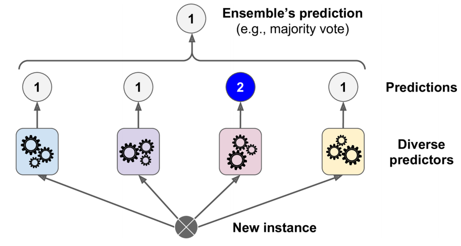
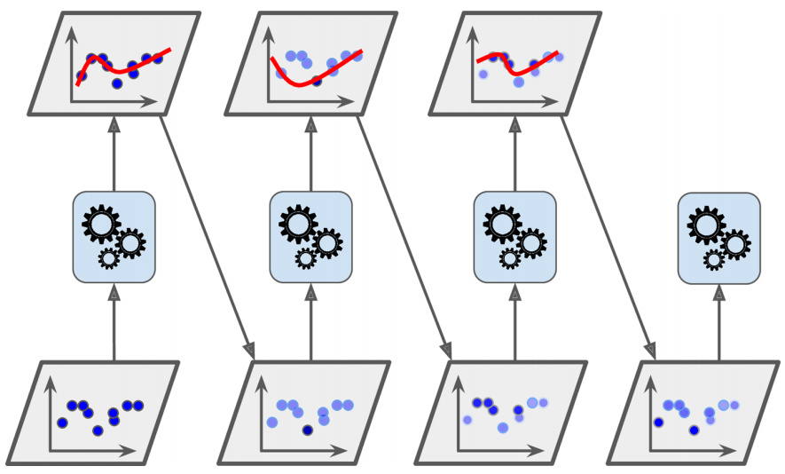

## Introduction

Decision Trees are powerful and highly interpretable models, but a single tree often suffers from high variance. Small changes in the training data may produce completely different tree structures, leading to unstable predictions.

One of the most successful strategies for improving predictive performance is to combine multiple models instead of relying on a single estimator. This idea is known as **ensemble learning**.

The central intuition is remarkably simple:

> A collection of diverse models often produces better predictions than any individual model.

Rather than trusting a single classifier, we train several models and combine their predictions using an aggregation rule. Although each individual model may make mistakes, these errors tend to cancel out when the models are sufficiently accurate and diverse.

::: {.concept-figure}
{#fig-diverse-classifier width=85% fig-align="center"}
:::

The resulting predictor is called an **ensemble**, and each individual predictor is referred to as a **base learner** or **weak learner**.

This chapter introduces the principal ensemble methods implemented in Scikit-Learn:

- Voting Classifiers
- Bagging and Pasting
- Random Forests
- AdaBoost
- Gradient Boosting
- Histogram-Based Gradient Boosting

## Voting Classifiers

Suppose that several independent classifiers are trained to solve the same classification problem. Each classifier produces its own prediction, and these predictions are then combined to obtain a final decision.

The simplest aggregation strategy is **majority voting**, where each classifier contributes one vote and the class receiving the largest number of votes becomes the ensemble prediction.

::: {.concept-figure}
{#fig-voting-classifier width=85% fig-align="center"}
:::

The idea behind majority voting is closely related to the **wisdom of crowds**. Even if individual classifiers are imperfect, combining several reasonably accurate and diverse predictors often leads to a model with better generalization performance than any single classifier.

In the following example we will build a Voting Classifier by combining three different learning algorithms and compare its predictive performance with that of each individual classifier.

### Building a Voting Classifier

To illustrate hard and soft voting, we will use the `make_moons()` dataset. This synthetic dataset contains two interleaving half circles and is useful for evaluating nonlinear classification boundaries.

We will combine three different classifiers:

- Logistic Regression;
- Random Forest;
- Support Vector Classifier.

Because these models rely on different learning principles, they are likely to make different errors. This diversity is precisely what makes the ensemble useful.

```{python}
#| label: create-voting-dataset

from sklearn.datasets import make_moons
from sklearn.ensemble import RandomForestClassifier, VotingClassifier
from sklearn.linear_model import LogisticRegression
from sklearn.model_selection import train_test_split
from sklearn.svm import SVC

X, y = make_moons(n_samples=500, noise=0.30, random_state=42)

X_train, X_test, y_train, y_test = train_test_split(X, y, random_state=42)
```

### Hard Voting

A hard-voting classifier collects the predicted class label from every estimator and selects the class receiving the largest number of votes.

```{python}
#| label: train-hard-voting-classifier

voting_clf = VotingClassifier(
    estimators=[
        ("lr", LogisticRegression(random_state=42)),
        ("rf", RandomForestClassifier(random_state=42)),
        ("svc", SVC(random_state=42))
    ],
    voting="hard"
)

voting_clf.fit(X_train, y_train)
```

The fitted estimators can be accessed through the `named_estimators_` attribute. This allows us to compare the performance of every individual classifier with that of the ensemble.

```{python}
#| label: evaluate-hard-voting-estimators

for name, clf in voting_clf.named_estimators_.items():
    print(name, "=",clf.score(X_test, y_test))
```

The prediction made by the ensemble for the first test observation can be obtained as follows:

```{python}
#| label: hard-voting-first-prediction

voting_clf.predict(X_test[:1])
```

We can also inspect the prediction produced by each individual classifier:

```{python}
#| label: inspect-individual-votes

[
    clf.predict(X_test[:1])
    for clf in voting_clf.estimators_
]
```

For example, the individual predictions may be

```text
[1, 1, 0]
```

In that case, two classifiers vote for class `1`, while one classifier votes for class `0`. The hard-voting ensemble therefore predicts class `1`.

The overall accuracy of the ensemble is:

```{python}
#| label: evaluate-hard-voting-classifier

voting_clf.score(X_test, y_test)
```

The Voting Classifier can outperform the individual estimators because their errors are not identical. When one model makes a mistake, the other classifiers may still produce the correct prediction.

::: {.callout-note}
## Hard voting

In hard voting, each estimator contributes exactly one class vote. The ensemble predicts the class receiving the majority of votes, regardless of how confident each classifier is.
:::

### Soft Voting

Hard voting only considers the predicted class. It does not use information about the confidence of the individual predictions.

When every classifier supports `predict_proba()`, the ensemble can instead average their estimated class probabilities. This strategy is called **soft voting**.

For an observation $\mathbf{x}$, suppose that classifier $m$ estimates the probability of class $k$ as

$$
\widehat{P}_m(y=k\mid\mathbf{x}).
$$

The soft-voting ensemble computes the average probability

$$
\widehat{P}_{\text{ensemble}}(y=k\mid\mathbf{x}) =\frac{1}{M}\sum_{m=1}^{M}
\widehat{P}_m(y=k\mid\mathbf{x}),
$$

where $M$ is the number of classifiers.

The final prediction is the class with the largest average probability:

$$
\widehat{y} = \underset{k}{\operatorname{arg\,max}}\;
\widehat{P}_{\text{ensemble}}(y=k\mid\mathbf{x}).
$$

The `SVC` class does not provide `predict_proba()` by default. To use it in a soft-voting ensemble, its `probability` hyperparameter must be set to `True`.

```{python}
#| label: train-soft-voting-classifier

soft_voting_clf = VotingClassifier(
    estimators=[
        ("lr", LogisticRegression(random_state=42)),
        ("rf", RandomForestClassifier(random_state=42)),
        ("svc", SVC(probability=True, random_state=42))
    ],
    voting="soft"
)

soft_voting_clf.fit(X_train, y_train)
```

We can again compare the individual estimators with the complete ensemble:

```{python}
#| label: evaluate-soft-voting-estimators

for name, clf in soft_voting_clf.named_estimators_.items():
    print(name, "=", clf.score(X_test, y_test))

print("Soft voting =", soft_voting_clf.score(X_test, y_test))
```

Soft voting often performs better than hard voting because highly confident predictions receive more influence than uncertain predictions.

For example, suppose three classifiers estimate the probability of class `1` as follows:

| Classifier | Estimated probability of class 1 |
|---|---:|
| Logistic Regression | 0.51 |
| Random Forest | 0.55 |
| SVC | 0.95 |

Hard voting treats the three predictions equally. Soft voting, however, takes into account that the SVC is considerably more confident.

::: {.callout-warning}
## Probability estimates in SVC

Setting `probability=True` makes `SVC` estimate class probabilities using an additional calibration procedure based on cross-validation. This increases training time but makes the classifier compatible with soft voting.
:::

::: {.callout-tip}
## Hard voting or soft voting?

Soft voting is generally preferable when the individual classifiers produce well-calibrated probability estimates. Hard voting may still be useful when probability estimates are unavailable or unreliable.
:::

## Bagging and Pasting

A diverse ensemble does not necessarily require different learning algorithms. Another strategy is to train the **same type of predictor** several times, using a different random subset of the training data for each model.

When the observations are sampled **with replacement**, the method is called **bagging**, short for *bootstrap aggregating*. When the observations are sampled **without replacement**, the method is called **pasting**.

The distinction is important:

- with **bagging**, the same training observation may appear more than once in the sample used to train a particular predictor;
- with **pasting**, each observation can appear at most once within the sample used by a particular predictor.

However, in both methods, the same observation may be used by several different predictors across the ensemble.

::: {.concept-figure}
{#fig-bagging-pasting width=85% fig-align="center"}
:::

@fig-bagging-pasting illustrates the central idea: several predictors are trained on different random samples drawn from the same training set.

Once all predictors have been trained, their predictions are aggregated:

- for classification, the ensemble typically uses the statistical mode or averaged class probabilities;
- for regression, the ensemble typically uses the average prediction.

Each individual predictor is trained on only part of the available data, so it may have slightly higher bias than a predictor trained on the complete training set. However, aggregating many diverse predictors generally reduces variance substantially.

As a result, a bagging or pasting ensemble often achieves a bias similar to that of a single predictor while producing more stable predictions.

Another important advantage is computational scalability. Since the individual predictors are independent, they can be trained and evaluated in parallel using multiple CPU cores or even different machines.

### Bagging and Pasting in Scikit-Learn

Scikit-Learn implements both strategies through `BaggingClassifier` for classification and `BaggingRegressor` for regression.

The following example trains an ensemble of 500 Decision Trees. Each tree is trained on 100 observations sampled randomly from the training set with replacement.

```{python}
#| label: train-bagging-classifier

from sklearn.ensemble import BaggingClassifier
from sklearn.tree import DecisionTreeClassifier

bag_clf = BaggingClassifier(estimator=DecisionTreeClassifier(random_state=42),
    n_estimators=500,
    max_samples=100,
    bootstrap=True,
    n_jobs=-1,
    random_state=42
)

bag_clf.fit(X_train, y_train)

y_pred = bag_clf.predict(X_test)
```

The main hyperparameters are:

- `estimator`: the base predictor trained repeatedly;
- `n_estimators`: the number of predictors in the ensemble;
- `max_samples`: the number or proportion of training observations used for each predictor;
- `bootstrap=True`: samples observations with replacement, producing bagging;
- `bootstrap=False`: samples observations without replacement, producing pasting;
- `n_jobs=-1`: uses all available CPU cores;
- `random_state`: ensures reproducibility.

::: {.callout-note}
## Aggregation in `BaggingClassifier`

When the base estimator supports `predict_proba()`, `BaggingClassifier` averages the estimated class probabilities across predictors. This is equivalent to soft voting.

Decision Trees provide `predict_proba()`, so a bagging ensemble of Decision Trees normally aggregates probabilities rather than only class labels.
:::

### Comparing a Single Tree with Bagging

To understand the effect of aggregation, we can compare the decision boundary of a single Decision Tree with the boundary produced by the bagging ensemble.

```{python}
#| label: fig-decision-tree-bagging
#| fig-cap: "Decision boundary of a single Decision Tree compared with an ensemble of Decision Trees trained using bagging."
#| fig-width: 10
#| fig-height: 4
#| code-fold: true
#| code-summary: "Show code"

import matplotlib.pyplot as plt
import numpy as np


def plot_decision_boundary(classifier, X, y, ax, alpha=1.0 ):
    axes = [-1.5, 2.4, -1.0, 1.5]

    x1, x2 = np.meshgrid(np.linspace(axes[0], axes[1], 200), np.linspace(axes[2], axes[3], 200))

    X_grid = np.c_[x1.ravel(), x2.ravel()]

    y_grid = classifier.predict(X_grid).reshape(x1.shape)

    ax.contourf(x1, x2, y_grid, alpha=0.3 * alpha, cmap="Wistia")

    ax.contour(x1, x2, y_grid, alpha=0.8 * alpha, cmap="Greys")

    colors = ["#78785c", "#c47b27"]
    markers = ("o", "^")

    for class_index in (0, 1):
        ax.plot(X[y == class_index, 0], X[y == class_index, 1], color=colors[class_index], marker=markers[class_index],linestyle="none")

    ax.axis(axes)
    ax.set_xlabel("$x_1$")
    ax.grid(alpha=0.2)


tree_clf = DecisionTreeClassifier(random_state=42)

tree_clf.fit(X_train, y_train)

fig, axes = plt.subplots(ncols=2, figsize=(10, 4), sharey=True)

plot_decision_boundary(tree_clf, X_train, y_train, ax=axes[0])

axes[0].set_title("Single Decision Tree")

axes[0].set_ylabel("$x_2$", rotation=0)

plot_decision_boundary(bag_clf, X_train, y_train, ax=axes[1])

axes[1].set_title("Decision Trees with Bagging")

plt.tight_layout()
plt.show()
```

The single Decision Tree produces a highly irregular decision boundary. This is a typical consequence of its high variance: small changes in the training data can generate substantially different partitions.

The bagging ensemble produces a smoother and more stable boundary. Although every individual tree remains a high-variance model, averaging their predictions reduces the variability of the ensemble.

Bagging generally introduces more diversity than pasting because bootstrap samples can contain repeated observations while excluding others. This additional diversity often reduces the correlation among the individual predictors.

The trade-off is that bagging may produce slightly higher bias than pasting. In practice, however, the reduction in variance often compensates for this increase, which is why bagging is generally preferred.

When computational resources permit, both methods can be compared using cross-validation.

---
## Random Patches and Random Subspaces
---

`BaggingClassifier` can also sample the input features used by each predictor. Feature sampling is controlled by:

- `max_features`;
- `bootstrap_features`.

These hyperparameters play the same role for features that `max_samples` and `bootstrap` play for observations.

When both training observations and features are sampled, the method is called **Random Patches**.

A typical configuration is:

```{python}
#| label: random-patches-example
#| eval: false

random_patches_clf = BaggingClassifier(estimator=DecisionTreeClassifier(),
    n_estimators=500,
    max_samples=0.8,
    bootstrap=True,
    max_features=0.8,
    bootstrap_features=True,
    n_jobs=-1,
    random_state=42
)
```

In contrast, the **Random Subspaces** method keeps all training observations but trains each predictor using only a random subset of the features.

```{python}
#| label: random-subspaces-example
#| eval: false

random_subspaces_clf = BaggingClassifier(estimator=DecisionTreeClassifier(),
    n_estimators=500,
    max_samples=1.0,
    bootstrap=False,
    max_features=0.8,
    bootstrap_features=True,
    n_jobs=-1,
    random_state=42
)
```

The distinction can be summarized as follows:

| Method | Sample observations? | Sample features? |
|---|---:|---:|
| Bagging | Yes, with replacement | No |
| Pasting | Yes, without replacement | No |
| Random Patches | Yes | Yes |
| Random Subspaces | No | Yes |

Feature sampling is particularly useful with high-dimensional datasets, such as images or text representations. It increases diversity among the individual predictors because each model observes a different subset of the available information.

As usual, this introduces a trade-off:

- more diversity generally reduces variance;
- using fewer features may increase bias.

The objective is not to make every individual predictor optimal, but to construct a collection of predictors whose combined errors are less correlated.


## Random Forests


A **Random Forest** is an ensemble of Decision Trees trained using the principles of **Bagging**, with one important additional source of randomness. Instead of evaluating every predictor when searching for the best split, each tree considers only a **random subset of the available features** at every internal node.

This simple modification greatly reduces the correlation between individual trees while preserving their predictive strength. As a result, the average prediction of the ensemble exhibits substantially lower variance than a single Decision Tree.

Random Forests are among the most successful machine learning algorithms because they:

- require very little preprocessing;
- naturally capture nonlinear relationships;
- automatically model feature interactions;
- are resistant to overfitting when enough trees are used;
- provide estimates of feature importance.

### From Bagging to Random Forests

Recall that Bagging constructs an ensemble by training many Decision Trees on different bootstrap samples of the training set.

A Random Forest follows exactly the same strategy, but introduces one additional randomization step during tree construction.

```{mermaid}
%%| echo: false
%%| label: fig-random-forest-workflow
%%| fig-cap: "Training process of a Random Forest."


flowchart LR

A["Training Set"]

A --> B1["Bootstrap Sample 1"]
A --> B2["Bootstrap Sample 2"]
A --> B3["Bootstrap Sample 3"]

B1 --> C1["Decision Tree"]
B2 --> C2["Decision Tree"]
B3 --> C3["Decision Tree"]

C1 --> D1["Random Features"]
C2 --> D2["Random Features"]
C3 --> D3["Random Features"]

D1 --> E["Majority Vote"]
D2 --> E
D3 --> E

E --> F["Final Prediction"]
```

The bootstrap sampling introduces diversity because every tree is trained on a different subset of observations.

Random feature selection introduces an additional source of diversity because the trees no longer evaluate exactly the same candidate splits.

Consequently, different trees tend to make different mistakes, and averaging their predictions reduces the overall variance of the ensemble.

::: {.callout-note}
## Why random feature selection matters

If a few predictors are extremely informative, ordinary Bagging tends to select those same variables near the root of almost every tree.

As a consequence, many trees become highly correlated.

Random Forests force each split to consider only a subset of the available predictors, encouraging different trees to discover different decision rules and reducing their correlation.
:::

### Training a Random Forest

Scikit-Learn provides the `RandomForestClassifier` class for classification problems and `RandomForestRegressor` for regression.

The following example trains a Random Forest containing 500 Decision Trees. Each tree is allowed to grow until it contains at most 16 leaf nodes.

```{python}
#| label: train-random-forest

from sklearn.ensemble import RandomForestClassifier

rnd_clf = RandomForestClassifier(
    n_estimators=500,
    max_leaf_nodes=16,
    n_jobs=-1,
    random_state=42
)

rnd_clf.fit(X_train, y_train)

y_pred_rf = rnd_clf.predict(X_test)
```

The most important hyperparameters are:

| Hyperparameter | Description |
|----------------|-------------|
| `n_estimators` | Number of trees in the forest. |
| `max_depth` | Maximum depth of each tree. |
| `max_leaf_nodes` | Maximum number of terminal nodes. |
| `min_samples_split` | Minimum observations required to split a node. |
| `min_samples_leaf` | Minimum observations required in every leaf. |
| `max_features` | Number of candidate features evaluated at each split. |
| `bootstrap` | Whether bootstrap sampling is used. |
| `n_jobs` | Number of CPU cores used for parallel training. |

For classification, the default value

```python
max_features="sqrt"
```

means that each split considers only approximately

$$
\sqrt{p}
$$

candidate predictors, where $p$ is the total number of input features.

This is the defining characteristic of a Random Forest.

### Random Forest as a specialized Bagging ensemble

A Random Forest can be viewed as a Bagging ensemble whose base estimator is a Decision Tree configured to examine only a random subset of predictors at every split.

The following Bagging model is essentially equivalent to the previous Random Forest.

```{python}
#| label: equivalent-bagging-random-forest

from sklearn.ensemble import BaggingClassifier
from sklearn.tree import DecisionTreeClassifier

bag_clf = BaggingClassifier(
    estimator=DecisionTreeClassifier(
        max_leaf_nodes=16,
        max_features="sqrt",
        random_state=42
    ),
    n_estimators=500,
    bootstrap=True,
    n_jobs=-1,
    random_state=42
)

bag_clf.fit(X_train, y_train)

y_pred_bag = bag_clf.predict(X_test)
```

Although the internal implementations differ for efficiency, both models follow the same underlying idea.

We can verify that their predictions are almost identical.

```{python}
#| label: compare-random-forest-and-bagging

import numpy as np

agreement = np.mean(
    y_pred_rf == y_pred_bag
)

print(
    f"Prediction agreement: {agreement:.2%}"
)
```

In practice, the prediction agreement is typically very close to 100%, illustrating that a Random Forest is fundamentally a specialized implementation of Bagging optimized for Decision Trees.

::: {.callout-tip}
## Bagging versus Random Forest

Random Forest is not a completely different algorithm from Bagging.

Instead, it extends Bagging by introducing random feature selection during tree construction.

This additional randomness decreases the correlation between trees, which often leads to lower variance and better predictive performance.
:::


## Boosting


**Boosting** refers to a family of ensemble methods that combine several weak learners into a strong predictor.

Unlike Bagging, where predictors are trained independently, Boosting trains predictors **sequentially**. Each new predictor is constructed to correct the errors made by the predictors trained before it.

The general idea can be represented as

$$
f_1(\mathbf{x})\longrightarrow f_2(\mathbf{x})\longrightarrow\cdots\longrightarrow f_M(\mathbf{x}),
$$

where the training of predictor $f_m(\mathbf{x})$ depends on the performance of the current ensemble.

Two of the most important boosting algorithms are:

- AdaBoost;
- Gradient Boosting.

They differ mainly in how they construct the correction:

- AdaBoost increases the importance of observations that were predicted incorrectly;
- Gradient Boosting trains each new predictor to approximate the remaining errors or negative gradients.


### AdaBoost


AdaBoost, short for **Adaptive Boosting**, trains a sequence of weak learners. After each iteration, the algorithm increases the relative importance of the training observations that were classified incorrectly.

The next predictor therefore concentrates more strongly on the difficult observations.

The procedure can be summarized as follows:

1. assign the same initial weight to every training observation;
2. train a weak learner;
3. evaluate its predictions;
4. increase the weights of the misclassified observations;
5. train the next learner using the updated weights;
6. combine all learners using weighted voting.

:::{.concept-figure}
{#fig-adaboost-weight-updates width=85% fig-align="center"}
:::

As illustrated in @fig-adaboost-weight-updates, each learner is influenced by the mistakes made at the previous stage.

### Sequential decision boundaries

The following experiment shows the decision boundaries produced by five consecutive predictors on the `make_moons()` dataset.

Each base predictor is a strongly regularized Support Vector Classifier with an RBF kernel. After every iteration, the weights of the misclassified observations are increased.

The left panel uses a learning rate of $1$, while the right panel uses a learning rate of $0.5$.

```{python}
#| label: fig-adaboost-sequential-boundaries
#| fig-cap: "Sequential decision boundaries produced by AdaBoost-like instance reweighting for two learning-rate values."
#| fig-width: 10
#| fig-height: 4
#| code-fold: true
#| code-summary: "Show code"

from sklearn.svm import SVC

m = len(X_train)

fig, axes = plt.subplots(
    ncols=2,
    figsize=(10, 4),
    sharey=True
)

for ax, learning_rate in zip(
    axes,
    (1.0, 0.5)
):
    sample_weights = np.ones(m) / m

    for iteration in range(5):
        svm_clf = SVC(
            C=0.2,
            gamma=0.6,
            random_state=42
        )

        svm_clf.fit(
            X_train,
            y_train,
            sample_weight=sample_weights * m
        )

        y_train_pred = svm_clf.predict(
            X_train
        )

        weighted_error = sample_weights[
            y_train_pred != y_train
        ].sum()

        error_rate = (
            weighted_error
            / sample_weights.sum()
        )

        estimator_weight = (
            learning_rate
            * np.log(
                (1 - error_rate)
                / error_rate
            )
        )

        sample_weights[
            y_train_pred != y_train
        ] *= np.exp(estimator_weight)

        sample_weights /= sample_weights.sum()

        plot_decision_boundary(
            svm_clf,
            X_train,
            y_train,
            ax=ax,
            alpha=0.4
        )

    ax.set_title(
        f"learning_rate = {learning_rate}"
    )

axes[1].set_ylabel("")

plt.tight_layout()
plt.show()
```

The first classifier makes several errors, so the corresponding observations receive larger weights.

The second classifier is therefore trained to focus more strongly on those observations. This process continues sequentially, and the ensemble gradually improves.

The learning rate controls how aggressively the observation weights are modified:

- a larger value produces stronger corrections;
- a smaller value produces more gradual changes.

This procedure resembles Gradient Descent in the sense that the model improves through a sequence of corrections. However, instead of adjusting the parameters of one predictor, AdaBoost adds new predictors to the ensemble.

::: {.callout-warning}
## Sequential training

AdaBoost cannot be fully parallelized because each predictor depends on the errors made by the previous predictor.

As a result, it generally scales less efficiently than Bagging or Pasting, where all predictors can be trained independently.
:::

### The AdaBoost algorithm

Suppose the training set contains $m$ observations.

Initially, every observation receives the same weight:

$$
w^{(i)}=\frac{1}{m}.
$$

After training predictor $j$, its weighted error rate is computed as

$$
r_j = \frac{\sum_{\substack{i=1 \\ \hat{y}_j^{(i)} \ne y^{(i)}}}^{m} w^{(i)}}{\sum_{i=1}^{m} w^{(i)}}
$$

where:

- $\widehat{y}_j^{(i)}$ is the prediction made by predictor $j$ for observation $i$;
- $y^{(i)}$ is the observed class;

A predictor with a smaller weighted error receives a larger contribution to the final ensemble.

Its weight is

$$
\alpha_j=\eta\log\left(\frac{1-r_j}{r_j}\right),
$$

where $\eta$ is the learning rate.

The observation weights are then updated according to

$$
w^{(i)}
\leftarrow
\begin{cases}
w^{(i)},
&
\widehat{y}_j^{(i)}
=
y^{(i)},
\\[6pt]
w^{(i)}
\exp(\alpha_j),
&
\widehat{y}_j^{(i)}
\neq
y^{(i)}.
\end{cases}
$$

Therefore:

- correctly classified observations retain their current weight;
- incorrectly classified observations receive a larger weight.

The weights are then normalized so that

$$
\sum_{i=1}^{m}w^{(i)}=1.
$$

The next predictor is fitted using these updated weights.

### Weighted voting

AdaBoost does not assign the same importance to every predictor.

For a new observation $\mathbf{x}$, the predicted class is the class receiving the largest total weighted vote:

$$
\hat{y}(\mathbf{x}) = \arg\max_{k} \sum^N_{\substack{j=1 \\ \hat{y}_j(\mathbf{x}) = k}} \alpha_j,
$$

where $N$ is the total number of predictors.

This differs from standard hard voting because predictors with lower weighted error contribute more strongly to the final decision.

### AdaBoost in Scikit-Learn

A common weak learner for AdaBoost is a **Decision Stump**, which is a Decision Tree with

```python
max_depth=1
```

A Decision Stump contains one internal decision node and two terminal nodes.

The following code trains an AdaBoost classifier using 200 Decision Stumps.

```{python}
#| label: train-adaboost-classifier

from sklearn.ensemble import AdaBoostClassifier
from sklearn.tree import DecisionTreeClassifier

ada_clf = AdaBoostClassifier(
    estimator=DecisionTreeClassifier(
        max_depth=1,
        random_state=42
    ),
    n_estimators=200,
    learning_rate=0.5,
    random_state=42
)

ada_clf.fit(X_train,y_train)
```

The current Scikit-Learn implementation uses SAMME for multiclass AdaBoost. If `estimator=None`, the default base learner is a `DecisionTreeClassifier` with `max_depth=1`.  [oai_citation:1‡Scikit-learn](https://scikit-learn.org/stable/modules/generated/sklearn.ensemble.AdaBoostClassifier.html?utm_source=chatgpt.com)

The ensemble can be evaluated on the test set:

```{python}
#| label: evaluate-adaboost-classifier

ada_accuracy = ada_clf.score(X_test, y_test)

print(
    f"AdaBoost test accuracy: {ada_accuracy:.3f}"
)
```

The principal hyperparameters are:

| Hyperparameter | Description |
|---|---|
| `estimator` | Weak learner fitted at each boosting stage. |
| `n_estimators` | Maximum number of weak learners in the ensemble. |
| `learning_rate` | Contribution assigned to each estimator. |
| `random_state` | Controls reproducibility. |

There is a direct trade-off between `learning_rate` and `n_estimators`:

- a larger learning rate allows stronger corrections with fewer estimators;
- a smaller learning rate generally requires more estimators but may improve generalization.  [oai_citation:2‡Scikit-learn](https://scikit-learn.org/stable/modules/generated/sklearn.ensemble.AdaBoostClassifier.html?utm_source=chatgpt.com)

::: {.callout-tip}
## Controlling overfitting

If an AdaBoost ensemble overfits the training data, useful strategies include:

- reducing `n_estimators`;
- decreasing `learning_rate`;
- increasing the regularization of the base learner;
- using shallower trees;
- selecting hyperparameters through cross-validation.
:::

::: {.callout-note}
## Weak learners

AdaBoost does not require every base learner to be highly accurate.

Its strength comes from combining several simple predictors, provided that each one performs at least slightly better than random guessing.
:::


### Gradient Boosting


Gradient Boosting is another sequential ensemble method. Like AdaBoost, it adds predictors one after another, with each new predictor attempting to improve the current ensemble.

The main difference concerns how each correction is constructed:

- **AdaBoost** increases the weights of observations that were incorrectly classified.
- **Gradient Boosting** trains each new predictor to approximate the errors left by the current ensemble.

For regression with squared-error loss, these errors correspond to the residuals

$$
r_i=y_i-F(\mathbf{x}_i),
$$

where $y_i$ is the observed response and $F(\mathbf{x}_i)$ is the current ensemble prediction.

When Decision Trees are used as base learners, the method is commonly called **Gradient Tree Boosting** or **Gradient-Boosted Regression Trees** (GBRT).

::: {.callout-note}
## Why begin with regression?

Gradient Boosting also supports classification. However, regression provides the clearest introduction because the corrections are ordinary numerical residuals.

More generally, each new predictor approximates the negative gradient of the selected loss function.
:::

### Building Gradient Boosting manually

We begin by generating a noisy quadratic dataset.

```{python}
#| label: create-gradient-boosting-data

import numpy as np
from sklearn.tree import DecisionTreeRegressor

rng = np.random.default_rng(42)

X_gbrt = rng.random((100, 1)) - 0.5

y_gbrt = (3 * X_gbrt[:, 0] ** 2 + rng.normal(0, 0.05, 100))
```

The first regression tree is fitted directly to the original target.

```{python}
#| label: fit-first-gradient-boosting-tree

tree_reg1 = DecisionTreeRegressor(
    max_depth=2,
    random_state=42
)

tree_reg1.fit(X_gbrt, y_gbrt)
```

Its prediction is

$$
F_1(\mathbf{x})=h_1(\mathbf{x}),
$$

where $h_1(\mathbf{x})$ denotes the first regression tree.

The residuals left by this tree are

$$
r_{i2}=y_i-h_1(\mathbf{x}_i).
$$

```{python}
#| label: compute-first-gradient-boosting-residuals

residuals_2 = (y_gbrt - tree_reg1.predict(X_gbrt))
```

The second tree is fitted to these residuals rather than to the original response.

```{python}
#| label: fit-second-gradient-boosting-tree

tree_reg2 = DecisionTreeRegressor(
    max_depth=2,
    random_state=43
)

tree_reg2.fit(X_gbrt, residuals_2)
```

The two-tree ensemble becomes

$$
F_2(\mathbf{x})=h_1(\mathbf{x})+h_2(\mathbf{x}).
$$

The new residuals are

$$
r_{i3}=y_i-h_1(\mathbf{x}_i)-h_2(\mathbf{x}_i).
$$

```{python}
#| label: compute-second-gradient-boosting-residuals

residuals_3 = (residuals_2 - tree_reg2.predict(X_gbrt))
```

A third tree is fitted to the remaining errors.

```{python}
#| label: fit-third-gradient-boosting-tree

tree_reg3 = DecisionTreeRegressor(
    max_depth=2,
    random_state=44
)

tree_reg3.fit(X_gbrt, residuals_3)
```

The complete three-tree ensemble is

$$
F_3(\mathbf{x})=h_1(\mathbf{x})+h_2(\mathbf{x})+h_3(\mathbf{x}).
$$

Predictions for new observations are obtained by adding the predictions of the three trees.

```{python}
#| label: predict-manual-gradient-boosting

X_new_gbrt = np.array([[-0.4], [0.0], [0.5]])

y_pred_gbrt = sum(
    tree.predict(X_new_gbrt)
    for tree in (
        tree_reg1,
        tree_reg2,
        tree_reg3
    )
)

y_pred_gbrt
```

### Visualizing sequential residual learning

The following function plots either the prediction of an individual tree or the sum of several trees.

```{python}
#| label: define-gradient-boosting-plot-function
#| code-fold: true
#| code-summary: "Show code"

import matplotlib.pyplot as plt


def plot_regression_predictions(
    regressors,
    X,
    y,
    ax,
    axes,
    style="-",
    label=None,
    data_style=".",
    data_label=None
):
    x_grid = np.linspace(
        axes[0],
        axes[1],
        500
    ).reshape(-1, 1)

    y_grid = sum(
        regressor.predict(x_grid)
        for regressor in regressors
    )

    ax.plot(
        X[:, 0],
        y,
        data_style,
        label=data_label
    )

    ax.plot(
        x_grid[:, 0],
        y_grid,
        style,
        linewidth=2,
        label=label
    )

    ax.axis(axes)
    ax.grid(alpha=0.25)

    if label is not None or data_label is not None:
        ax.legend(
            loc="upper center",
            fontsize=9
        )
```

```{python}
#| label: fig-gradient-boosting-sequential
#| fig-cap: "Sequential residual learning in Gradient Boosting. Each new tree approximates the errors left by the current ensemble."
#| fig-width: 9
#| fig-height: 9
#| code-fold: true
#| code-summary: "Show code"

fig, axes = plt.subplots(
    nrows=3,
    ncols=2,
    figsize=(9, 9)
)

# First boosting stage
plot_regression_predictions(
    [tree_reg1],
    X_gbrt,
    y_gbrt,
    ax=axes[0, 0],
    axes=[-0.5, 0.5, -0.2, 0.8],
    label="$h_1(x)$",
    data_label="Training data"
)

axes[0, 0].set_title(
    "Residual targets and tree predictions"
)

axes[0, 0].set_ylabel(
    "$y$",
    rotation=0
)

plot_regression_predictions(
    [tree_reg1],
    X_gbrt,
    y_gbrt,
    ax=axes[0, 1],
    axes=[-0.5, 0.5, -0.2, 0.8],
    label="$F_1(x)=h_1(x)$",
    data_label="Training data"
)

axes[0, 1].set_title(
    "Ensemble predictions"
)

# Second boosting stage
plot_regression_predictions(
    [tree_reg2],
    X_gbrt,
    residuals_2,
    ax=axes[1, 0],
    axes=[-0.5, 0.5, -0.4, 0.6],
    label="$h_2(x)$",
    data_style="+",
    data_label="Residuals: $y-h_1(x)$"
)

axes[1, 0].set_ylabel(
    "$r_2$",
    rotation=0
)

plot_regression_predictions(
    [tree_reg1, tree_reg2],
    X_gbrt,
    y_gbrt,
    ax=axes[1, 1],
    axes=[-0.5, 0.5, -0.2, 0.8],
    label="$F_2(x)=h_1(x)+h_2(x)$"
)

# Third boosting stage
plot_regression_predictions(
    [tree_reg3],
    X_gbrt,
    residuals_3,
    ax=axes[2, 0],
    axes=[-0.5, 0.5, -0.4, 0.6],
    label="$h_3(x)$",
    data_style="+",
    data_label=(
        "Residuals: "
        "$y-h_1(x)-h_2(x)$"
    )
)

axes[2, 0].set_xlabel("$x$")
axes[2, 0].set_ylabel(
    "$r_3$",
    rotation=0
)

plot_regression_predictions(
    [tree_reg1, tree_reg2, tree_reg3],
    X_gbrt,
    y_gbrt,
    ax=axes[2, 1],
    axes=[-0.5, 0.5, -0.2, 0.8],
    label=(
        "$F_3(x)="
        "h_1(x)+h_2(x)+h_3(x)$"
    )
)

axes[2, 1].set_xlabel("$x$")

plt.tight_layout()
plt.show()
```

The left column shows the target used to train each new tree:

1. the original response;
2. the residuals left by the first tree;
3. the residuals left by the first two trees.

The right column shows the cumulative prediction of the ensemble.

In the first row, the ensemble contains only one tree. In the second row, the second tree corrects part of the first tree's errors. In the final row, a third tree approximates the remaining residuals.

The ensemble prediction gradually approaches the nonlinear pattern in the data.

---
### Gradient Boosting with Scikit-Learn
---

The same procedure can be implemented directly with `GradientBoostingRegressor`.

```{python}
#| label: train-gradient-boosting-regressor

from sklearn.ensemble import GradientBoostingRegressor

gbrt = GradientBoostingRegressor(
    max_depth=2,
    n_estimators=3,
    learning_rate=1.0,
    random_state=42
)

gbrt.fit(X_gbrt, y_gbrt)
```

The model combines two groups of hyperparameters.

Tree-level hyperparameters regulate the complexity of the individual learners:

- `max_depth`;
- `min_samples_split`;
- `min_samples_leaf`;
- `max_leaf_nodes`.

Ensemble-level hyperparameters regulate the boosting process:

- `n_estimators`;
- `learning_rate`;
- `subsample`;
- `loss`;
- `n_iter_no_change`.

---
### Learning Rate and Shrinkage
---

The `learning_rate` hyperparameter scales the contribution of each tree.

Instead of adding the complete prediction from tree $m$, Gradient Boosting updates the ensemble according to

$$
F_m(\mathbf{x})=F_{m-1}(\mathbf{x})+\eta h_m(\mathbf{x}),
$$

where $\eta$ is the learning rate.

When $\eta=1$, each tree contributes its complete correction. When $\eta<1$, every correction is reduced.

This regularization technique is called **shrinkage**.

A smaller learning rate generally requires a larger number of trees:

$$
\text{smaller learning rate}
\quad\Longrightarrow\quad
\text{more boosting stages}.
$$

However, applying more gradual corrections often improves generalization.

```{python}
#| label: train-gradient-boosting-learning-rates

gbrt_fast = GradientBoostingRegressor(
    max_depth=2,
    n_estimators=3,
    learning_rate=1.0,
    random_state=42
)

gbrt_slow = GradientBoostingRegressor(
    max_depth=2,
    n_estimators=200,
    learning_rate=0.1,
    random_state=42
)

gbrt_fast.fit(X_gbrt, y_gbrt)

gbrt_slow.fit(X_gbrt, y_gbrt)
```

```{python}
#| label: fig-gradient-boosting-learning-rate
#| fig-cap: "Effect of combining the learning rate and the number of trees in Gradient Boosting."
#| fig-width: 10
#| fig-height: 4
#| code-fold: true
#| code-summary: "Show code"

fig, axes = plt.subplots(
    ncols=2,
    figsize=(10, 4),
    sharey=True
)

plot_regression_predictions(
    [gbrt_fast],
    X_gbrt,
    y_gbrt,
    ax=axes[0],
    axes=[-0.5, 0.5, -0.1, 0.8],
    label="Ensemble prediction",
    data_label="Training data"
)

axes[0].set_title(
    "learning_rate = "
    f"{gbrt_fast.learning_rate}, "
    "n_estimators = "
    f"{gbrt_fast.n_estimators}"
)

axes[0].set_xlabel("$x$")
axes[0].set_ylabel(
    "$y$",
    rotation=0
)

plot_regression_predictions(
    [gbrt_slow],
    X_gbrt,
    y_gbrt,
    ax=axes[1],
    axes=[-0.5, 0.5, -0.1, 0.8],
    label="Ensemble prediction",
    data_label="Training data"
)

axes[1].set_title(
    "learning_rate = "
    f"{gbrt_slow.learning_rate}, "
    "n_estimators = "
    f"{gbrt_slow.n_estimators}"
)

axes[1].set_xlabel("$x$")

plt.tight_layout()
plt.show()
```

The first model uses only three trees, each making a large correction. The second model applies smaller corrections but uses many more trees.

The `learning_rate` and `n_estimators` hyperparameters must therefore be tuned jointly.

::: {.callout-tip}
## Learning rate and number of estimators

A low learning rate with too few estimators may underfit.

A high learning rate or an excessive number of trees may produce an ensemble that adapts too closely to the training data.
:::

---
### Early Stopping
---

The number of trees can be selected using **early stopping**.

As trees are added, training error generally decreases. Validation error initially decreases as well, but may eventually stop improving or begin to increase.

The objective is to stop near the minimum validation error.

### Selecting the best stage with `staged_predict()`

The `staged_predict()` method returns the ensemble predictions after every boosting stage:

- after one tree;
- after two trees;
- after three trees;
- and so forth.

We first divide the data into training and validation subsets.

```{python}
#| label: split-gradient-boosting-validation-data

from sklearn.metrics import mean_squared_error
from sklearn.model_selection import train_test_split

(X_gbrt_train, X_gbrt_val, y_gbrt_train, y_gbrt_val) = train_test_split(X_gbrt, y_gbrt, test_size=0.25, random_state=49)
```

A preliminary ensemble containing 120 trees is then fitted.

```{python}
#| label: train-gradient-boosting-staged-model

gbrt_staged = GradientBoostingRegressor(
    max_depth=2,
    n_estimators=120,
    random_state=42
)

gbrt_staged.fit(X_gbrt_train, y_gbrt_train)
```

The validation MSE is calculated after each boosting stage.

```{python}
#| label: compute-gradient-boosting-staged-errors

validation_errors = np.array([
    mean_squared_error(y_gbrt_val, staged_prediction)
    for staged_prediction
    in gbrt_staged.staged_predict(X_gbrt_val)
])

best_n_estimators = (np.argmin(validation_errors) + 1)

minimum_validation_error = (validation_errors[best_n_estimators - 1])

best_n_estimators
```

A final model is trained using the selected number of trees.

```{python}
#| label: train-best-gradient-boosting-model

gbrt_best = GradientBoostingRegressor(
    max_depth=2,
    n_estimators=best_n_estimators,
    random_state=42
)

gbrt_best.fit(X_gbrt_train, y_gbrt_train)
```

```{python}
#| label: fig-gradient-boosting-early-stopping
#| fig-cap: "Validation error at each boosting stage and prediction from the selected ensemble."
#| fig-width: 10
#| fig-height: 4
#| code-fold: true
#| code-summary: "Show code"

fig, axes = plt.subplots(
    ncols=2,
    figsize=(10, 4)
)

n_trees = np.arange(
    1,
    len(validation_errors) + 1
)

axes[0].plot(
    n_trees,
    validation_errors,
    ".-"
)

axes[0].axvline(
    best_n_estimators,
    linestyle="--"
)

axes[0].axhline(
    minimum_validation_error,
    linestyle="--"
)

axes[0].plot(
    best_n_estimators,
    minimum_validation_error,
    "o"
)

axes[0].annotate(
    "Minimum",
    xy=(
        best_n_estimators,
        minimum_validation_error
    ),
    xytext=(
        best_n_estimators + 10,
        minimum_validation_error * 1.25
    ),
    arrowprops=dict(
        arrowstyle="->"
    )
)

axes[0].set_xlabel(
    "Number of trees"
)

axes[0].set_ylabel(
    "Validation MSE"
)

axes[0].set_title(
    "Validation error"
)

axes[0].grid(alpha=0.25)

plot_regression_predictions(
    [gbrt_best],
    X_gbrt,
    y_gbrt,
    ax=axes[1],
    axes=[-0.5, 0.5, -0.1, 0.8],
    label="Selected ensemble",
    data_label="Complete dataset"
)

axes[1].set_title(
    f"Selected model "
    f"({best_n_estimators} trees)"
)

axes[1].set_xlabel("$x$")
axes[1].set_ylabel(
    "$y$",
    rotation=0
)

plt.tight_layout()
plt.show()
```

Initially, adding trees reduces the validation error because the model captures more of the underlying structure.

After the optimal stage, additional trees may provide little improvement or begin to model noise.

::: {.callout-warning}
## Preserve the test set

Early stopping is a model-selection procedure. The number of trees must be selected using validation data or cross-validation, not the final test set.
:::

### Incremental early stopping with `warm_start`

Setting

```python
warm_start=True
```

allows `GradientBoostingRegressor` to preserve its previously fitted trees when `fit()` is called again with a larger value of `n_estimators`.

The following procedure stops after five consecutive iterations without improvement.

```{python}
#| label: manual-gradient-boosting-early-stopping

gbrt_warm = GradientBoostingRegressor(
    max_depth=2,
    warm_start=True,
    random_state=42
)

minimum_val_error = np.inf
rounds_without_improvement = 0
patience = 5
best_iteration = 0

for n_estimators in range(1, 121):

    gbrt_warm.n_estimators = n_estimators

    gbrt_warm.fit(X_gbrt_train, y_gbrt_train)

    validation_prediction = (gbrt_warm.predict(X_gbrt_val))

    validation_error = mean_squared_error(y_gbrt_val, validation_prediction)

    if validation_error < minimum_val_error:
        minimum_val_error = validation_error
        best_iteration = n_estimators
        rounds_without_improvement = 0
    else:
        rounds_without_improvement += 1
        if rounds_without_improvement >= patience:
            break

print("Last fitted number of trees:", gbrt_warm.n_estimators)

print("Best iteration:", best_iteration)

print("Minimum validation MSE:", minimum_val_error)
```

The final fitted estimator may contain several trees added after the minimum validation error was reached. Therefore, the selected model should be refitted using `best_iteration`.

```{python}
#| label: refit-gradient-boosting-after-early-stopping

gbrt_warm_best = GradientBoostingRegressor(
    max_depth=2,
    n_estimators=best_iteration,
    random_state=42
)

gbrt_warm_best.fit(X_gbrt_train, y_gbrt_train)
```

::: {.callout-note}
## Built-in early stopping

`GradientBoostingRegressor` can also perform automatic early stopping using `n_iter_no_change`, `validation_fraction`, and `tol`.

This is generally more convenient than implementing the procedure manually.
:::

---
### Stochastic Gradient Boosting
---

`GradientBoostingRegressor` supports the `subsample` hyperparameter, which controls the fraction of training observations used to fit each tree.

For example,

```python
subsample=0.25
```

means that every tree is trained on a random sample containing 25% of the training observations.

```{python}
#| label: train-stochastic-gradient-boosting

stochastic_gbrt = GradientBoostingRegressor(
    max_depth=2,
    n_estimators=200,
    learning_rate=0.05,
    subsample=0.25,
    random_state=42
)

stochastic_gbrt.fit(X_gbrt_train, y_gbrt_train)
```

This method is called **Stochastic Gradient Boosting**.

Sampling observations introduces additional randomness into the ensemble. This generally produces:

- greater diversity among trees;
- lower variance;
- faster training;
- potentially higher bias.

The bias–variance trade-off is similar to the one observed in Bagging and Random Forests, although the trees are still trained sequentially.

::: {.callout-tip}
## When is stochastic boosting useful?

Using `subsample < 1.0` can improve generalization when the complete Gradient Boosting model overfits. It can also substantially reduce training time on large datasets.
:::


### XGBoost


**XGBoost**, short for *Extreme Gradient Boosting*, is an optimized implementation of gradient-boosted trees.

It follows the same general principle introduced previously: trees are added sequentially, and each new tree attempts to improve the predictions made by the current ensemble. However, XGBoost extends conventional Gradient Boosting with several computational and statistical improvements.

Among its principal characteristics are:

- efficient tree construction;
- histogram-based split finding;
- explicit regularization;
- support for missing values;
- parallelization of parts of the tree-building process;
- built-in evaluation during training;
- early stopping;
- support for CPU and GPU execution.

::: {.callout-note}
## XGBoost is still a boosting method

XGBoost does not replace the fundamental logic of Gradient Boosting.

It provides a highly optimized and regularized implementation of gradient-boosted trees.
:::

### Installing XGBoost

XGBoost is not part of Scikit-Learn and must be installed separately.

Run the following command in the terminal:

```bash
python3 -m pip install xgboost
```

The installation command should not be included as an executable Python cell inside the book. The package only needs to be installed once in the environment used to render the chapter.

### Scikit-Learn-compatible interface

XGBoost provides an estimator interface that follows the conventions of Scikit-Learn.

For regression, the principal estimator is `XGBRegressor`.

```{python}
#| label: import-xgboost-regressor

from xgboost import XGBRegressor
```

The following model is trained using the same regression data introduced in the Gradient Boosting section.

```{python}
#| label: train-xgboost-regressor

xgb_reg = XGBRegressor(
    objective="reg:squarederror",
    n_estimators=200,
    learning_rate=0.05,
    max_depth=2,
    subsample=0.8,
    colsample_bytree=0.8,
    tree_method="hist",
    random_state=42
)

xgb_reg.fit(X_gbrt_train, y_gbrt_train)
```

Predictions are obtained using the familiar Scikit-Learn API.

```{python}
#| label: predict-xgboost-regressor

y_pred_xgb = xgb_reg.predict(X_gbrt_val)
```

The validation error can then be evaluated using the Mean Squared Error.

```{python}
#| label: evaluate-xgboost-regressor

xgb_validation_mse = mean_squared_error(y_gbrt_val, y_pred_xgb)

print(f"XGBoost validation MSE: " f"{xgb_validation_mse:.6f}")
```

The estimator behaves similarly to `GradientBoostingRegressor`, but some hyperparameter names differ.

| XGBoost hyperparameter | Role |
|---|---|
| `n_estimators` | Maximum number of boosting rounds. |
| `learning_rate` | Contribution of each new tree. |
| `max_depth` | Maximum depth of the individual trees. |
| `subsample` | Fraction of training observations used by each tree. |
| `colsample_bytree` | Fraction of predictors sampled for each tree. |
| `min_child_weight` | Minimum amount of information required in a child node. |
| `reg_alpha` | L1 regularization penalty. |
| `reg_lambda` | L2 regularization penalty. |
| `tree_method` | Algorithm used to construct the trees. |
| `objective` | Loss function optimized during training. |

For squared-error regression, the objective is

```python
objective="reg:squarederror"
```

### Regularization in XGBoost

The objective optimized by XGBoost can be expressed conceptually as

$$
\mathcal{L}^{(t)}=\sum_{i=1}^{n}\ell\left(y_i,\widehat{y}_i^{(t)}\right)+\sum_{k=1}^{t}\Omega(f_k),
$$

where:

- $\ell(\cdot)$ is the predictive loss;
- $f_k$ is tree $k$;
- $\Omega(f_k)$ penalizes the complexity of the tree.

A commonly used tree-complexity penalty has the form

$$
\Omega(f)=\gamma T+\frac{1}{2}\lambda\sum_{j=1}^{T}w_j^2,
$$

where:

- $T$ is the number of terminal nodes;
- $w_j$ is the prediction assigned to leaf $j$;
- $\gamma$ penalizes the creation of additional leaves;
- $\lambda$ controls L2 regularization of the leaf values.

This explicit penalty distinguishes XGBoost from the basic Gradient Boosting formulation.

::: {.callout-note}
## Two levels of regularization

XGBoost can regulate the ensemble through:

1. the structure of the trees, using parameters such as `max_depth`, `min_child_weight`, and `gamma`;
2. the magnitude of the leaf predictions, using `reg_alpha` and `reg_lambda`.
:::

### Early stopping with `XGBRegressor`

XGBoost can evaluate a validation set after every boosting round and stop when the selected metric no longer improves.

For current versions of XGBoost, `early_stopping_rounds` and `eval_metric` are specified when constructing the estimator. The validation data are supplied to `fit()` through `eval_set`.

```{python}
#| label: train-xgboost-early-stopping

xgb_early_stop = XGBRegressor(
    objective="reg:squarederror",
    n_estimators=1000,
    learning_rate=0.03,
    max_depth=2,
    subsample=0.8,
    colsample_bytree=0.8,
    tree_method="hist",
    eval_metric="rmse",
    early_stopping_rounds=20,
    random_state=42
)

xgb_early_stop.fit(X_gbrt_train, y_gbrt_train, eval_set=[(X_gbrt_val, y_gbrt_val)],verbose=False)
```

Although the model allows a maximum of 1,000 trees, training stops when the validation RMSE fails to improve for 20 consecutive boosting rounds.

The best iteration and validation score are stored in fitted attributes.

```{python}
#| label: inspect-xgboost-best-iteration

print("Best iteration:", xgb_early_stop.best_iteration)

print("Best validation score:", xgb_early_stop.best_score)
```

Predictions from the Scikit-Learn-compatible interface use the best boosting iteration automatically.

```{python}
#| label: evaluate-xgboost-early-stopping

y_pred_xgb_early = xgb_early_stop.predict(X_gbrt_val)

xgb_early_mse = mean_squared_error(y_gbrt_val, y_pred_xgb_early)

print(f"Early-stopped XGBoost validation MSE: " f"{xgb_early_mse:.6f}")
```

::: {.callout-warning}
## Validation data are used for model selection

The dataset passed through `eval_set` influences the selected number of boosting rounds.

It must therefore be a validation set, not the final test set.
:::

### Inspecting the learning curves

The validation metrics recorded during training are available through `evals_result()`.

```{python}
#| label: extract-xgboost-evaluation-history

xgb_evaluation_history = (xgb_early_stop.evals_result())

validation_rmse = (xgb_evaluation_history["validation_0"]["rmse"])
```

The learning curve can be plotted as a function of the boosting iteration.

```{python}
#| label: fig-xgboost-learning-curve
#| fig-cap: "Validation RMSE across XGBoost boosting rounds."
#| fig-width: 8
#| fig-height: 5
#| code-fold: true
#| code-summary: "Show code"

fig, ax = plt.subplots(
    figsize=(8, 5)
)

boosting_rounds = np.arange(
    1,
    len(validation_rmse) + 1
)

ax.plot(
    boosting_rounds,
    validation_rmse
)

ax.axvline(
    xgb_early_stop.best_iteration + 1,
    linestyle="--",
    label=(
        "Best iteration: "
        f"{xgb_early_stop.best_iteration + 1}"
    )
)

ax.set_xlabel(
    "Boosting round"
)

ax.set_ylabel(
    "Validation RMSE"
)

ax.set_title(
    "XGBoost validation history"
)

ax.legend()
ax.grid(alpha=0.25)

plt.show()
```

The curve generally decreases rapidly during the first boosting stages and then improves more slowly. Early stopping prevents the model from continuing once additional trees no longer produce a meaningful validation improvement.

### Comparing Scikit-Learn Gradient Boosting and XGBoost

The two implementations share the same basic sequential-learning principle, but their capabilities differ.

| Characteristic | `GradientBoostingRegressor` | `XGBRegressor` |
|---|---|---|
| Sequential boosted trees | Yes | Yes |
| Scikit-Learn-style API | Yes | Yes |
| Histogram-based tree construction | No | Yes |
| Observation subsampling | Yes | Yes |
| Feature subsampling | Limited | Extensive |
| Explicit L1 and L2 penalties | No | Yes |
| Built-in missing-value handling | Limited | Yes |
| CPU parallelization | Limited | Yes |
| GPU support | No | Yes |
| Built-in evaluation history | Limited | Yes |
| Early stopping | Yes | Yes |

`GradientBoostingRegressor` remains useful for small and medium-sized datasets and for introducing the boosting algorithm clearly.

XGBoost is generally more appropriate when:

- the dataset is large;
- training speed matters;
- stronger regularization is required;
- missing values are present;
- feature subsampling is useful;
- CPU or GPU acceleration is needed.

::: {.callout-tip}
## Practical recommendation

Begin with a simple baseline such as `GradientBoostingRegressor` or `HistGradientBoostingRegressor`.

Use XGBoost when its additional regularization, scalability, missing-value handling, or computational optimizations are relevant to the problem.
:::

### Native XGBoost interface

XGBoost also provides a lower-level interface based on the `DMatrix` data structure and the `xgb.train()` function.

This interface provides more direct control over training but is not necessary for most Scikit-Learn workflows.

```{python}
#| label: train-xgboost-native-interface
#| eval: false

import xgboost as xgb

dtrain = xgb.DMatrix(X_gbrt_train, label=y_gbrt_train)

dvalid = xgb.DMatrix(X_gbrt_val, label=y_gbrt_val)

xgb_parameters = {
    "objective": "reg:squarederror",
    "eval_metric": "rmse",
    "eta": 0.03,
    "max_depth": 2,
    "subsample": 0.8,
    "colsample_bytree": 0.8,
    "tree_method": "hist",
    "seed": 42
}

evaluation_sets = [(dtrain, "train"), (dvalid, "validation")]

xgb_booster = xgb.train(
    params=xgb_parameters,
    dtrain=dtrain,
    num_boost_round=1000,
    evals=evaluation_sets,
    early_stopping_rounds=20,
    verbose_eval=False
)
```

When early stopping is used with the native interface, predictions from the best iteration should be requested explicitly.

```{python}
#| label: predict-xgboost-native-interface
#| eval: false

y_pred_native = xgb_booster.predict(dvalid, iteration_range=(0, xgb_booster.best_iteration + 1))
```

::: {.callout-note}
## Which interface should be used?

The Scikit-Learn-compatible interface is generally preferable when XGBoost is part of a workflow involving:

- pipelines;
- cross-validation;
- hyperparameter searches;
- Scikit-Learn metrics;
- preprocessing transformers.

The native interface is useful when lower-level control over the booster is required.
:::