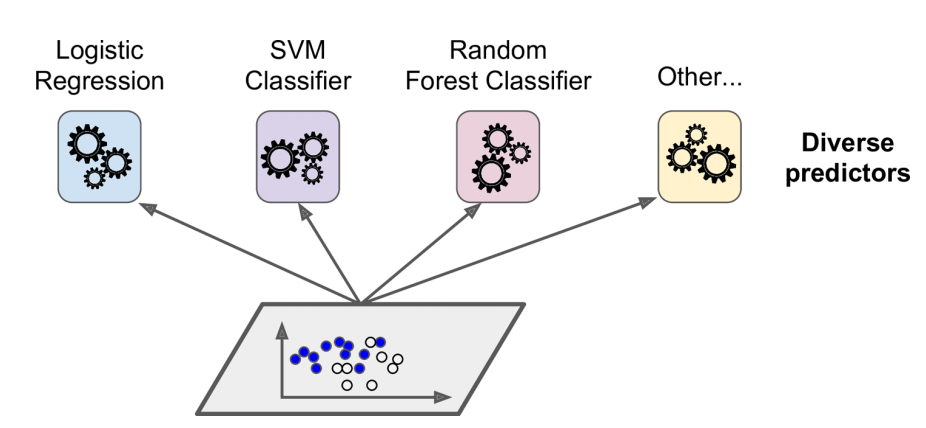
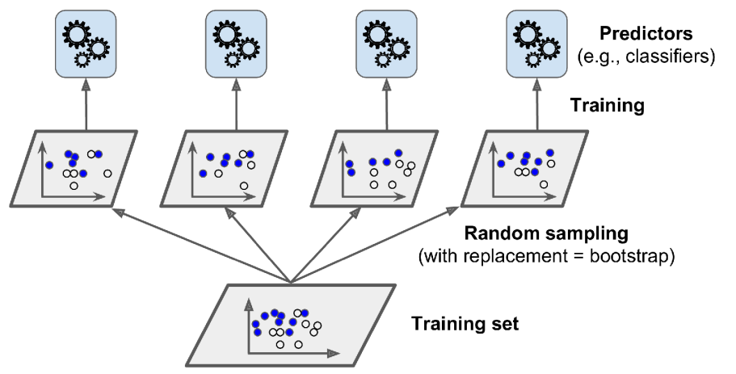



## Introduction

Before working through the examples:

- review classification probabilities, decision trees, and cross-validation;
- run the examples in order because later sections reuse the data splits and fitted models;
- treat every test set as a lockbox: use training and validation data for decisions, then evaluate the selected model on the test set once.

While reading, ask two questions about every ensemble: **how are its base learners made diverse, and how are their predictions combined?**

::: {.callout-note}
## Learning objectives

After completing this chapter, you should be able to:

1. distinguish voting, bagging, random forests, boosting, and stacking;
2. choose an ensemble method from the data, computational constraints, and required output;
3. construct leakage-safe classification and regression evaluation workflows;
4. explain out-of-bag (OOB) evaluation and two forms of feature importance;
5. derive the main SAMME AdaBoost updates and identify their edge conditions;
6. connect manual gradient boosting to Scikit-Learn's implementation;
7. use histogram gradient boosting and optionally XGBoost without making the chapter depend on XGBoost.
:::

## Why ensembles work

A single decision tree is interpretable but unstable: a small change in its training data can produce a different structure. An **ensemble** combines several **base learners** to obtain one prediction. Base learners need not be statistically independent; in practice they are usually dependent because they share data. What matters is that they are sufficiently **diverse**, so their errors are not perfectly correlated.

The term **weak learner** is narrower than *base learner*. It usually describes the deliberately simple learner used in boosting, often one that performs only slightly better than chance. A random-forest tree can be a deep base learner and need not be weak.

> Averaging reduces variance most effectively when the component errors are not too strongly correlated.

::: {.concept-figure}
{#fig-ch09-diverse-classifiers width=85% fig-align="center"}
:::

This principle underlies bagging [@breiman1996bagging], random forests [@breiman2001randomforests], boosting [@freund1997adaboost; @friedman2001greedy], and stacking [@wolpert1992stacked].

## Evaluation protocols used in this chapter

Model selection and final assessment answer different questions. Validation data or cross-validation choose methods and hyperparameters. A test set estimates performance only after those choices are fixed. Repeatedly checking test performance turns the test set into validation data and makes its estimate optimistic.

All random operations below use deterministic seeds. Estimator counts and dataset sizes are intentionally modest to control rendering time.

### Stratified classification split

The class proportions are preserved in both splits. We first reserve 20% as a final test set, then reserve 25% of the remaining observations as validation data. This produces a 60/20/20 train/validation/test allocation.

```{python}
#| label: ch09-classification-split

import importlib.util
import matplotlib.pyplot as plt
import numpy as np
import pandas as pd
from sklearn.base import clone
from sklearn.datasets import make_classification, make_moons
from sklearn.ensemble import (
    AdaBoostClassifier,
    BaggingClassifier,
    GradientBoostingRegressor,
    HistGradientBoostingRegressor,
    RandomForestClassifier,
    StackingClassifier,
    VotingClassifier,
)
from sklearn.inspection import permutation_importance
from sklearn.linear_model import LogisticRegression
from sklearn.metrics import accuracy_score, mean_squared_error
from sklearn.model_selection import StratifiedKFold, train_test_split
from sklearn.pipeline import make_pipeline
from sklearn.preprocessing import StandardScaler
from sklearn.svm import SVC
from sklearn.tree import DecisionTreeClassifier, DecisionTreeRegressor

SEED = 42

X_cls, y_cls = make_classification(
    n_samples=800,
    n_features=8,
    n_informative=5,
    n_redundant=1,
    class_sep=0.9,
    weights=[0.60, 0.40],
    flip_y=0.04,
    random_state=SEED,
)

X_cls_dev, X_cls_test, y_cls_dev, y_cls_test = train_test_split(
    X_cls,
    y_cls,
    test_size=0.20,
    stratify=y_cls,
    random_state=SEED,
)
X_cls_train, X_cls_val, y_cls_train, y_cls_val = train_test_split(
    X_cls_dev,
    y_cls_dev,
    test_size=0.25,
    stratify=y_cls_dev,
    random_state=SEED,
)

classification_candidates = {}
classification_validation_scores = {}
```

The final classification test variables are created here but are not inspected until the final classification evaluation.

### Regression train/validation/test split

Regression has no class labels to stratify. A deterministic random split is appropriate for these independent synthetic observations. Time-ordered or grouped data would instead require a time-aware or group-aware splitter.

```{python}
#| label: ch09-regression-split

rng = np.random.default_rng(SEED)
X_reg = rng.uniform(-0.5, 0.5, size=(500, 1))
y_reg = 3 * X_reg[:, 0] ** 2 + rng.normal(0, 0.08, size=500)

X_reg_dev, X_reg_test, y_reg_dev, y_reg_test = train_test_split(
    X_reg, y_reg, test_size=0.20, random_state=SEED
)
X_reg_train, X_reg_val, y_reg_train, y_reg_val = train_test_split(
    X_reg_dev, y_reg_dev, test_size=0.25, random_state=SEED
)

regression_candidates = {}
regression_validation_mse = {}
```

For a small real regression dataset, repeated $K$-fold cross-validation on the development set is often more stable than one validation split. The test set must still remain untouched.

## Method-selection guide

| Situation | Good starting point | Reason | Main caution |
|---|---|---|---|
| Several already useful, different classifiers | Hard or soft voting | Simple combination | Soft voting needs comparable, calibrated probabilities |
| High-variance base model | Bagging | Reduces variance through resampling | Less useful for stable, strongly biased models |
| Mostly tabular data and little preprocessing | Random forest | Strong nonlinear baseline; parallel training | Large forests can be memory intensive |
| Simple sequential classifier | AdaBoost | Focuses on difficult observations | Sensitive to mislabeled points and outliers |
| Accurate nonlinear regression/classification | Gradient boosting | Optimizes a chosen loss stage by stage | Learning rate and number of stages interact |
| Large tabular data, missing values | Histogram gradient boosting | Fast binning and native missing-value support | Binning is an approximation |
| Strong heterogeneous models | Stacking | Learns how to combine predictions | Meta-features must be out-of-fold |
| Extra regularization and scalable boosted trees | XGBoost | Gradient/Hessian optimization and systems features | External dependency and larger tuning surface |

No row is a guarantee. Compare plausible candidates by cross-validation or validation performance, latency, memory, calibration, and interpretability.

## Voting classifiers

Voting combines predictions from different fitted classifiers. Their algorithms may differ, but calling them *independent* would be unjustified when they use the same training observations.

### Hard voting

Hard voting gives each estimator one class vote and predicts the mode.

::: {.concept-figure}
{#fig-ch09-hard-voting width=85% fig-align="center"}
:::

```{python}
#| label: ch09-hard-voting

hard_voter = VotingClassifier(
    estimators=[
        ("lr", make_pipeline(
            StandardScaler(), LogisticRegression(solver="liblinear", random_state=SEED)
        )),
        ("rf", RandomForestClassifier(n_estimators=100, random_state=SEED, n_jobs=-1)),
        ("svc", make_pipeline(StandardScaler(), SVC(random_state=SEED))),
    ],
    voting="hard",
)
hard_voter.fit(X_cls_train, y_cls_train)

hard_voting_val_accuracy = hard_voter.score(X_cls_val, y_cls_val)
print(f"Hard-voting validation accuracy: {hard_voting_val_accuracy:.3f}")
```

An ensemble can outperform its components when their errors differ, but this is not guaranteed. Highly correlated mistakes or a poor component can erase the benefit.

### Soft voting and actual disagreement

Soft voting averages class probabilities. With estimator weights $a_m$,

$$
\widehat P(y=k\mid\mathbf{x})=
\frac{\sum_{m=1}^{M}a_m\widehat P_m(y=k\mid\mathbf{x})}
{\sum_{m=1}^{M}a_m}.
$$

`VotingClassifier` uses equal estimator weights, $a_m=1$, unless `weights=` is supplied. Equal weights do **not** mean that a confident estimator has a larger estimator weight; its extreme probability can have more effect on the arithmetic average. That influence is trustworthy only when probabilities are reasonably calibrated and comparable. `SVC(probability=True)` adds an internal probability-fitting step, but calibration should still be checked on appropriate held-out or cross-validated predictions [@scikitLearn2025].

```{python}
#| label: ch09-soft-voting-disagreement

soft_voter = VotingClassifier(
    estimators=[
        ("lr", make_pipeline(
            StandardScaler(), LogisticRegression(solver="liblinear", random_state=SEED)
        )),
        ("rf", RandomForestClassifier(n_estimators=100, random_state=SEED, n_jobs=-1)),
        ("svc", make_pipeline(StandardScaler(), SVC(probability=True, random_state=SEED))),
    ],
    voting="soft",
)
soft_voter.fit(X_cls_train, y_cls_train)

component_predictions = np.column_stack([
    estimator.predict(X_cls_val) for estimator in soft_voter.estimators_
])
disagreement_rows = np.flatnonzero(
    np.any(component_predictions != component_predictions[:, [0]], axis=1)
)

if disagreement_rows.size:
    row = disagreement_rows[0]
    probabilities = np.vstack([
        estimator.predict_proba(X_cls_val[[row]])[0]
        for estimator in soft_voter.estimators_
    ])
    print("Component class predictions:", component_predictions[row].tolist())
    print("Component P(class=1):", np.round(probabilities[:, 1], 3).tolist())
    print("Equal-weight mean P(class=1):", round(probabilities[:, 1].mean(), 3))
    print("Soft-voting prediction:", int(soft_voter.predict(X_cls_val[[row]])[0]))
else:
    print("No component disagreement occurred on this deterministic validation split.")

soft_voting_val_accuracy = soft_voter.score(X_cls_val, y_cls_val)
classification_candidates["soft voting"] = soft_voter
classification_validation_scores["soft voting"] = soft_voting_val_accuracy
```

This example searches the validation set for an observation on which fitted components actually disagree; it does not present hypothetical labels that conflict with the displayed probabilities.

## Bagging, pasting, random patches, and random subspaces

Bagging trains the same type of base estimator on bootstrap samples, drawn **with replacement**. Pasting samples observations **without replacement**. Predictions can be trained in parallel because the fitted estimators do not depend on one another [@breiman1996bagging].

::: {.concept-figure}
{#fig-ch09-bagging-pasting width=85% fig-align="center"}
:::

```{python}
#| label: ch09-bagging-classifier

bag_classifier = BaggingClassifier(
    estimator=DecisionTreeClassifier(random_state=SEED),
    n_estimators=100,
    max_samples=0.70,
    bootstrap=True,
    oob_score=True,
    n_jobs=-1,
    random_state=SEED,
)
bag_classifier.fit(X_cls_train, y_cls_train)

bagging_val_accuracy = bag_classifier.score(X_cls_val, y_cls_val)
classification_candidates["bagging"] = bag_classifier
classification_validation_scores["bagging"] = bagging_val_accuracy
print(f"Bagging validation accuracy: {bagging_val_accuracy:.3f}")
```

If the base estimator implements `predict_proba()`, `BaggingClassifier` averages probabilities; otherwise it combines class predictions.

**Random patches** samples both observations and features for each base estimator. Either sampling operation may be with or without replacement; replacement is not part of the definition. **Random subspaces** uses all observations for every base estimator but samples features.

```{python}
#| label: ch09-random-patches-subspaces

random_patches = BaggingClassifier(
    estimator=DecisionTreeClassifier(random_state=SEED),
    n_estimators=50,
    max_samples=0.70,
    bootstrap=True,
    max_features=0.75,
    bootstrap_features=False,
    n_jobs=-1,
    random_state=SEED,
).fit(X_cls_train, y_cls_train)

random_subspaces = BaggingClassifier(
    estimator=DecisionTreeClassifier(random_state=SEED),
    n_estimators=50,
    max_samples=1.0,
    bootstrap=False,
    max_features=0.75,
    bootstrap_features=False,
    n_jobs=-1,
    random_state=SEED,
).fit(X_cls_train, y_cls_train)

print("Random patches validation accuracy:", round(random_patches.score(X_cls_val, y_cls_val), 3))
print("Random subspaces validation accuracy:", round(random_subspaces.score(X_cls_val, y_cls_val), 3))
```

| Method | Observation subset per estimator | Feature subset per estimator |
|---|---|---|
| Bagging | Yes, with replacement | No |
| Pasting | Yes, without replacement | No |
| Random patches | Yes | Yes |
| Random subspaces | No; all observations | Yes |

Feature sampling can lower correlation among base learners, especially in high dimensions, but removing informative features can increase bias.

### Single-tree and bagging boundaries

The following visualization uses a separate two-dimensional dataset only for plotting. It does not affect model selection or test evaluation.

```{python}
#| label: ch09-plotting-data

X_moons, y_moons = make_moons(n_samples=500, noise=0.30, random_state=SEED)
X_moons_train, _, y_moons_train, _ = train_test_split(
    X_moons, y_moons, test_size=0.20, stratify=y_moons, random_state=SEED
)

tree_moons = DecisionTreeClassifier(random_state=SEED).fit(X_moons_train, y_moons_train)
bag_moons = BaggingClassifier(
    estimator=DecisionTreeClassifier(random_state=SEED),
    n_estimators=100,
    max_samples=0.70,
    bootstrap=True,
    n_jobs=-1,
    random_state=SEED,
).fit(X_moons_train, y_moons_train)


def plot_decision_boundary(classifier, X, y, ax):
    bounds = [-1.6, 2.5, -1.1, 1.6]
    x1, x2 = np.meshgrid(
        np.linspace(bounds[0], bounds[1], 180),
        np.linspace(bounds[2], bounds[3], 180),
    )
    grid = np.c_[x1.ravel(), x2.ravel()]
    predictions = classifier.predict(grid).reshape(x1.shape)
    ax.contourf(x1, x2, predictions, alpha=0.25, cmap="Wistia")
    ax.contour(x1, x2, predictions, alpha=0.6, cmap="Greys")
    for class_index, color, marker in [(0, "#78785c", "o"), (1, "#c47b27", "^")]:
        ax.plot(
            X[y == class_index, 0], X[y == class_index, 1],
            color=color, marker=marker, linestyle="none", markersize=4,
        )
    ax.axis(bounds)
    ax.set_xlabel("$x_1$")
    ax.grid(alpha=0.2)
```

```{python}
#| label: fig-ch09-tree-bagging-boundaries
#| fig-cap: "A single decision tree and a bagging ensemble on the same training data."
#| fig-width: 10
#| fig-height: 4
#| code-fold: true

fig, axes = plt.subplots(ncols=2, figsize=(10, 4), sharey=True)
plot_decision_boundary(tree_moons, X_moons_train, y_moons_train, axes[0])
plot_decision_boundary(bag_moons, X_moons_train, y_moons_train, axes[1])
axes[0].set_title("Single decision tree")
axes[1].set_title("Bagged decision trees")
axes[0].set_ylabel("$x_2$", rotation=0)
plt.tight_layout()
plt.show()
```

The bagged boundary is often smoother because averaging reduces variance. This illustration does not prove that bagging always generalizes better; depth, sample size, noise, and base-learner stability all matter.

## Random forests

A random forest fits trees to bootstrap samples and, crucially, draws a new random set of **candidate features at every split**. It does not assign one fixed feature subset to an entire tree. The best split among those candidates is selected. For classification, Scikit-Learn averages class probabilities across trees and then chooses the largest average, rather than simply describing the implementation as a majority vote [@breiman2001randomforests; @scikitLearn2025].

```{mermaid}
%%| echo: false
%%| label: fig-ch09-random-forest-workflow
%%| fig-cap: "Random-forest training and prediction workflow."
flowchart LR
    A[Training data] --> B1[Bootstrap sample 1]
    A --> B2[Bootstrap sample 2]
    A --> B3[Bootstrap sample M]
    B1 --> C1[Tree: new random candidate features at each split]
    B2 --> C2[Tree: new random candidate features at each split]
    B3 --> C3[Tree: new random candidate features at each split]
    C1 --> D[Average class probabilities]
    C2 --> D
    C3 --> D
    D --> E[Class with largest average probability]
```

More trees generally stabilize a forest's Monte Carlo average, but they do not guarantee protection from overfitting. Excessively deep trees, leakage, unsuitable features, distribution shift, or hyperparameter selection against a test set can still harm generalization. Likewise, a bagged tree model and a random forest may agree often under some settings, but near-100% agreement is neither required nor generally expected because implementations and feature randomization differ.

```{python}
#| label: ch09-random-forest-oob

forest = RandomForestClassifier(
    n_estimators=150,
    max_features="sqrt",
    min_samples_leaf=2,
    bootstrap=True,
    oob_score=True,
    n_jobs=-1,
    random_state=SEED,
)
forest.fit(X_cls_train, y_cls_train)

forest_val_accuracy = forest.score(X_cls_val, y_cls_val)
classification_candidates["random forest"] = forest
classification_validation_scores["random forest"] = forest_val_accuracy
print(f"OOB accuracy: {forest.oob_score_:.3f}")
print(f"Validation accuracy: {forest_val_accuracy:.3f}")
```

### Why OOB evaluation works

For a bootstrap sample of size $n$, the probability that observation $i$ is omitted is

$$
P(i\text{ omitted})=\left(1-\frac{1}{n}\right)^n
\longrightarrow e^{-1}\approx 0.368.
$$

Thus each observation is OOB for roughly 36.8% of the trees. Let $\mathcal T_i^{\text{OOB}}$ be those trees. Its OOB probability estimate is

$$
\widehat P_{\text{OOB}}(y=k\mid\mathbf{x}_i)=
\frac{1}{|\mathcal T_i^{\text{OOB}}|}
\sum_{t\in\mathcal T_i^{\text{OOB}}}\widehat P_t(y=k\mid\mathbf{x}_i).
$$

The `oob_score_` above compares these aggregated predictions with the training labels. OOB performance is a convenient internal estimate, not a replacement for a final test set. With few trees or few observations, some OOB aggregates are noisy; dependent or grouped observations can also violate the logic of observation-level resampling.

### Impurity and held-out permutation importance

Mean decrease in impurity (MDI), exposed as `feature_importances_`, accumulates training-time impurity reductions. It is fast but can favor continuous or high-cardinality features and can distribute importance unpredictably among correlated predictors.

Permutation importance measures the drop in a fitted model's score after shuffling one feature in **held-out validation data**. It reflects dependence of this model's predictions on that feature under the validation distribution, not causality.

```{python}
#| label: ch09-feature-importance

feature_names = [f"x{index}" for index in range(X_cls.shape[1])]
mdi = pd.Series(forest.feature_importances_, index=feature_names, name="MDI")

permutation = permutation_importance(
    forest,
    X_cls_val,
    y_cls_val,
    scoring="accuracy",
    n_repeats=10,
    random_state=SEED,
    n_jobs=-1,
)
importance_table = pd.DataFrame({
    "impurity_importance": mdi,
    "permutation_mean": permutation.importances_mean,
    "permutation_std": permutation.importances_std,
}).sort_values("permutation_mean", ascending=False)
importance_table
```

Correlated features can substitute for one another, making each feature's permutation drop appear small. Importance also says nothing about effect direction. Repeat importance estimates, inspect uncertainty, and combine them with domain knowledge.

## Boosting

Boosting adds base learners sequentially. AdaBoost changes observation weights; gradient boosting follows the negative gradient of a loss. Sequential dependence limits stage-level parallelism.

## AdaBoost and SAMME

AdaBoost increases the relative weight of misclassified observations and combines learners with weighted votes [@freund1997adaboost]. Decision stumps are common weak learners, but any compatible estimator that supports `sample_weight` may be used.

::: {.concept-figure}
{#fig-ch09-adaboost-weights width=85% fig-align="center"}
:::

For normalized observation weights $w_i^{(m)}$, the weighted error of learner $h_m$ is

$$
r_m=\sum_{i=1}^{n}w_i^{(m)}\mathbb{1}\{h_m(\mathbf{x}_i)\ne y_i\}.
$$

For $K$ classes, discrete SAMME assigns

$$
\alpha_m=\eta\left[\log\left(\frac{1-r_m}{r_m}\right)+\log(K-1)\right].
$$

For binary classification, $K=2$ and $\log(K-1)=0$, giving

$$
\alpha_m=\eta\log\left(\frac{1-r_m}{r_m}\right).
$$

Weights are updated and renormalized:

$$
w_i^{(m+1)}\propto w_i^{(m)}
\exp\left(\alpha_m\mathbb{1}\{h_m(\mathbf{x}_i)\ne y_i\}\right).
$$

The final class maximizes $\sum_m\alpha_m\mathbb{1}\{h_m(\mathbf{x})=k\}$.

The edge conditions matter. If $r_m=0$, the learner is perfect and boosting can stop rather than evaluate an infinite log ratio. SAMME requires $r_m<1-1/K$ for positive estimator weight; at that random-guessing threshold $\alpha_m=0$, and a worse learner should be rejected or training stopped. Implementations also guard numerical calculations near 0 and 1. Scikit-Learn 1.6 uses the SAMME algorithm for `AdaBoostClassifier` [@scikitLearn2025].

```{python}
#| label: ch09-adaboost-classifier

adaboost = AdaBoostClassifier(
    estimator=DecisionTreeClassifier(max_depth=1, random_state=SEED),
    n_estimators=100,
    learning_rate=0.5,
    random_state=SEED,
)
adaboost.fit(X_cls_train, y_cls_train)

adaboost_val_accuracy = adaboost.score(X_cls_val, y_cls_val)
classification_candidates["AdaBoost"] = adaboost
classification_validation_scores["AdaBoost"] = adaboost_val_accuracy
print(f"AdaBoost validation accuracy: {adaboost_val_accuracy:.3f}")
```

### Cumulative AdaBoost stages

`staged_predict()` returns the **cumulative ensemble** after each stage. The following figure therefore shows ensemble boundaries, not the boundaries of isolated base learners.

```{python}
#| label: fig-ch09-adaboost-cumulative
#| fig-cap: "Cumulative AdaBoost ensemble boundaries after 1, 5, and 20 boosting stages."
#| fig-width: 11
#| fig-height: 3.8
#| code-fold: true

ada_moons = AdaBoostClassifier(
    estimator=DecisionTreeClassifier(max_depth=1, random_state=SEED),
    n_estimators=20,
    learning_rate=0.5,
    random_state=SEED,
).fit(X_moons_train, y_moons_train)

bounds = [-1.6, 2.5, -1.1, 1.6]
x1, x2 = np.meshgrid(
    np.linspace(bounds[0], bounds[1], 180),
    np.linspace(bounds[2], bounds[3], 180),
)
grid = np.c_[x1.ravel(), x2.ravel()]
selected_stages = {1, 5, 20}
stage_predictions = {
    stage: prediction
    for stage, prediction in enumerate(ada_moons.staged_predict(grid), start=1)
    if stage in selected_stages
}

fig, axes = plt.subplots(ncols=3, figsize=(11, 3.8), sharey=True)
for ax, stage in zip(axes, sorted(selected_stages)):
    ax.contourf(x1, x2, stage_predictions[stage].reshape(x1.shape), alpha=0.25, cmap="Wistia")
    for class_index, color, marker in [(0, "#78785c", "o"), (1, "#c47b27", "^")]:
        ax.plot(
            X_moons_train[y_moons_train == class_index, 0],
            X_moons_train[y_moons_train == class_index, 1],
            color=color, marker=marker, linestyle="none", markersize=3,
        )
    ax.axis(bounds)
    ax.set_title(f"Cumulative stage {stage}")
    ax.set_xlabel("$x_1$")
    ax.grid(alpha=0.2)
axes[0].set_ylabel("$x_2$", rotation=0)
plt.tight_layout()
plt.show()
```

Noise and mislabeled observations can repeatedly attract weight, so regularize the base learner and select `learning_rate` and `n_estimators` by validation or cross-validation.

## Gradient boosting

Gradient boosting constructs an additive model by following the negative gradient of a differentiable loss [@friedman2001greedy]. For squared-error regression,

$$
L(y,F)=\frac{1}{2}(y-F)^2,
\qquad
-\frac{\partial L}{\partial F}=y-F,
$$

so negative gradients are ordinary residuals.

### Manual squared-error gradient boosting

The initial predictor is the constant minimizing training loss,

$$
F_0(\mathbf{x})=\bar y_{\text{train}}.
$$

At stage $m$, fit a tree $h_m$ to $r_{im}=y_i-F_{m-1}(\mathbf{x}_i)$ and update

$$
F_m(\mathbf{x})=F_{m-1}(\mathbf{x})+\eta h_m(\mathbf{x}).
$$

This construction includes the initial estimator and `learning_rate`, making it conceptually comparable to `GradientBoostingRegressor` under squared loss. Exact predictions can still differ because production implementations optimize leaf values and include additional details.

```{python}
#| label: ch09-manual-gradient-boosting

learning_rate = 0.10
n_manual_stages = 3
F0 = float(np.mean(y_reg_train))
train_prediction = np.full(y_reg_train.shape, F0, dtype=float)
manual_trees = []
manual_residuals = []

for stage in range(n_manual_stages):
    negative_gradient = y_reg_train - train_prediction
    tree = DecisionTreeRegressor(max_depth=2, random_state=SEED + stage)
    tree.fit(X_reg_train, negative_gradient)
    train_prediction += learning_rate * tree.predict(X_reg_train)
    manual_trees.append(tree)
    manual_residuals.append(negative_gradient.copy())


def manual_gradient_boosting_predict(X):
    prediction = np.full(X.shape[0], F0, dtype=float)
    for tree in manual_trees:
        prediction += learning_rate * tree.predict(X)
    return prediction


print("Manual validation MSE:", round(mean_squared_error(
    y_reg_val, manual_gradient_boosting_predict(X_reg_val)
), 5))
```

```{python}
#| label: fig-ch09-gradient-boosting-stages
#| fig-cap: "Negative-gradient targets and cumulative manual gradient-boosting predictions."
#| fig-width: 9
#| fig-height: 8
#| code-fold: true

x_grid = np.linspace(-0.5, 0.5, 300).reshape(-1, 1)
fig, axes = plt.subplots(nrows=3, ncols=2, figsize=(9, 8), sharex=True)
cumulative_grid = np.full(x_grid.shape[0], F0)

for stage, (tree, residual) in enumerate(zip(manual_trees, manual_residuals), start=1):
    axes[stage - 1, 0].plot(X_reg_train[:, 0], residual, ".", alpha=0.45)
    axes[stage - 1, 0].plot(x_grid[:, 0], tree.predict(x_grid), linewidth=2)
    axes[stage - 1, 0].set_ylabel(f"$r_{stage}$", rotation=0)
    axes[stage - 1, 0].set_title(f"Stage {stage} negative gradient and $h_{stage}(x)$")

    cumulative_grid += learning_rate * tree.predict(x_grid)
    axes[stage - 1, 1].plot(X_reg_train[:, 0], y_reg_train, ".", alpha=0.35)
    axes[stage - 1, 1].plot(x_grid[:, 0], cumulative_grid, linewidth=2)
    axes[stage - 1, 1].set_title(f"$F_{stage}(x)=F_{{{stage-1}}}(x)+\\eta h_{stage}(x)$")
    for ax in axes[stage - 1]:
        ax.grid(alpha=0.2)

axes[-1, 0].set_xlabel("$x$")
axes[-1, 1].set_xlabel("$x$")
plt.tight_layout()
plt.show()
```

The left column shows each stage's training target and fitted base learner. The right column shows the cumulative ensemble, including $F_0$ and shrinkage.

### Validation-based stage selection

`staged_predict()` evaluates every cumulative stage. Selection uses validation MSE, never test MSE.

```{python}
#| label: ch09-gradient-boosting-validation

gbrt_search = GradientBoostingRegressor(
    max_depth=2,
    n_estimators=200,
    learning_rate=0.05,
    random_state=SEED,
)
gbrt_search.fit(X_reg_train, y_reg_train)

gbrt_validation_curve = np.array([
    mean_squared_error(y_reg_val, prediction)
    for prediction in gbrt_search.staged_predict(X_reg_val)
])
best_gbrt_stages = int(np.argmin(gbrt_validation_curve) + 1)

gbrt_selected = GradientBoostingRegressor(
    max_depth=2,
    n_estimators=best_gbrt_stages,
    learning_rate=0.05,
    random_state=SEED,
).fit(X_reg_train, y_reg_train)

regression_candidates["gradient boosting"] = gbrt_selected
regression_validation_mse["gradient boosting"] = float(gbrt_validation_curve.min())
print("Selected stages:", best_gbrt_stages)
print("Gradient boosting validation MSE:", round(gbrt_validation_curve.min(), 6))
```

Smaller learning rates usually require more stages. `subsample < 1` produces stochastic gradient boosting, which may improve generalization and reduce stage cost at the expense of noisier updates. Tune these choices jointly.

## Histogram gradient boosting

`HistGradientBoostingRegressor` first bins continuous feature values into at most `max_bins` integer bins, then searches split points over bins rather than every observed value. This substantially improves scaling on larger tabular datasets. It supports native missing values: training learns whether missing observations should go left or right at each split. In Scikit-Learn 1.6, categorical columns can be identified from pandas `category` dtypes with `categorical_features="from_dtype"`; their categories must fit within `max_bins` [@scikitLearn2025].

Built-in early stopping reserves `validation_fraction` from the supplied training data and monitors validation loss. That internal split is part of model fitting; our external validation set still compares candidate methods.

```{python}
#| label: ch09-hist-gradient-boosting

hist_gbrt = HistGradientBoostingRegressor(
    learning_rate=0.08,
    max_iter=200,
    max_leaf_nodes=15,
    early_stopping=True,
    validation_fraction=0.20,
    n_iter_no_change=10,
    random_state=SEED,
).fit(X_reg_train, y_reg_train)

hist_val_prediction = hist_gbrt.predict(X_reg_val)
hist_val_mse = mean_squared_error(y_reg_val, hist_val_prediction)
regression_candidates["histogram gradient boosting"] = hist_gbrt
regression_validation_mse["histogram gradient boosting"] = hist_val_mse
print("Iterations fitted:", hist_gbrt.n_iter_)
print("Histogram gradient boosting validation MSE:", round(hist_val_mse, 6))

# A separate fitted example demonstrates native missing-value routing without
# changing the data used for candidate comparison or final evaluation.
X_reg_train_missing = X_reg_train.copy()
X_reg_train_missing[::31, 0] = np.nan
hist_missing_demo = HistGradientBoostingRegressor(
    max_iter=30, random_state=SEED
).fit(X_reg_train_missing, y_reg_train)
print("Prediction for a missing value:", round(hist_missing_demo.predict([[np.nan]])[0], 4))
```

The separate missing-value example is deterministic and does not alter model comparison. In practice, missingness can carry information or reflect data-quality problems; native handling does not remove the need to investigate its cause.

## Leakage-safe stacking

Stacking trains a **final estimator** on predictions from several base estimators [@wolpert1992stacked]. If the meta-model saw in-sample predictions from base models fitted on the same rows, those predictions would be unrealistically optimistic. `StackingClassifier` avoids this by generating meta-features with internal out-of-fold (OOF) predictions from `cv`, then refitting base estimators on all supplied training data [@scikitLearn2025].

Preprocessing belongs inside each base estimator's pipeline so each OOF fold fits scaling only on that fold's training portion.

```{python}
#| label: ch09-stacking-classifier

stack_cv = StratifiedKFold(n_splits=5, shuffle=True, random_state=SEED)
stacking = StackingClassifier(
    estimators=[
        ("lr", make_pipeline(
            StandardScaler(), LogisticRegression(solver="liblinear", random_state=SEED)
        )),
        ("rf", RandomForestClassifier(
            n_estimators=100, min_samples_leaf=2, n_jobs=-1, random_state=SEED
        )),
        ("svc", make_pipeline(
            StandardScaler(), SVC(probability=True, random_state=SEED)
        )),
    ],
    final_estimator=LogisticRegression(solver="liblinear", random_state=SEED),
    cv=stack_cv,
    stack_method="predict_proba",
    n_jobs=-1,
)
stacking.fit(X_cls_train, y_cls_train)

stacking_val_accuracy = stacking.score(X_cls_val, y_cls_val)
classification_candidates["stacking"] = stacking
classification_validation_scores["stacking"] = stacking_val_accuracy
print(f"Stacking validation accuracy: {stacking_val_accuracy:.3f}")
```

The external validation set selects among complete candidate pipelines. The final test set remains untouched.

## Final classification evaluation

Validation accuracy now selects exactly one candidate. We clone it, refit it on the full development set, and evaluate the classification test set once. This estimate should be reported with uncertainty in a real study; one split can be noisy.

```{python}
#| label: ch09-final-classification-test

classification_validation_table = pd.Series(
    classification_validation_scores, name="validation_accuracy"
).sort_values(ascending=False)
display(classification_validation_table.to_frame())

selected_classifier_name = classification_validation_table.index[0]
selected_classifier = clone(classification_candidates[selected_classifier_name])
selected_classifier.fit(X_cls_dev, y_cls_dev)

final_classification_prediction = selected_classifier.predict(X_cls_test)
final_classification_accuracy = accuracy_score(
    y_cls_test, final_classification_prediction
)
print("Selected classifier:", selected_classifier_name)
print(f"Final test accuracy (one use): {final_classification_accuracy:.3f}")
```

Do not return to model selection after seeing this result. If the result triggers a redesign, obtain a genuinely new test set for the redesigned workflow.

## XGBoost

XGBoost is an external implementation of regularized gradient-boosted trees [@chen2016xgboost]. At boosting stage $t$, it approximates the change in objective with first derivatives $g_i$ and second derivatives $h_i$:

$$
\widetilde{\mathcal L}^{(t)}=
\sum_i\left[g_i f_t(\mathbf{x}_i)+\frac{1}{2}h_i f_t(\mathbf{x}_i)^2\right]
+\Omega(f_t),
$$

where $g_i=\partial_{\hat y}\ell(y_i,\hat y_i)$ describes direction, $h_i=\partial^2_{\hat y}\ell(y_i,\hat y_i)$ describes local curvature, and a common regularizer is

$$
\Omega(f)=\gamma T+\frac{1}{2}\lambda\sum_{j=1}^{T}w_j^2.
$$

Using both gradients and Hessians gives a second-order local approximation for scoring splits and leaf values. `min_child_weight` is the minimum **sum of instance Hessians** required in a child, not a generic count of observations or an unspecified amount of information. For squared error the Hessian is constant, so it behaves similarly to a minimum weighted count; for other objectives its meaning differs.

XGBoost is not a Scikit-Learn dependency. Install it separately only when needed. The guarded cell below remains executable when it is absent and adds XGBoost to regression model selection only when available.

```{python}
#| label: ch09-optional-xgboost

xgboost_available = importlib.util.find_spec("xgboost") is not None

if xgboost_available:
    from xgboost import XGBRegressor

    xgb_regressor = XGBRegressor(
        objective="reg:squarederror",
        n_estimators=200,
        learning_rate=0.05,
        max_depth=2,
        min_child_weight=2,
        subsample=0.8,
        colsample_bytree=1.0,
        reg_lambda=1.0,
        tree_method="hist",
        n_jobs=2,
        random_state=SEED,
    )
    xgb_regressor.fit(X_reg_train, y_reg_train, verbose=False)
    xgb_val_mse = mean_squared_error(
        y_reg_val, xgb_regressor.predict(X_reg_val)
    )
    regression_candidates["XGBoost"] = xgb_regressor
    regression_validation_mse["XGBoost"] = xgb_val_mse
    print("XGBoost validation MSE:", round(xgb_val_mse, 6))
else:
    print("XGBoost is not installed; skipping the optional example.")
```

XGBoost also offers missing-value routing, histogram split finding, row and column subsampling, L1/L2 regularization, early stopping, and CPU/GPU implementations. Exact constructor and early-stopping APIs vary by XGBoost version, so consult the documentation for the installed version rather than assuming Scikit-Learn controls that API.

## Final regression evaluation

The lowest validation MSE selects one model. The selected candidate is refit on all development observations before the single final test evaluation.

```{python}
#| label: ch09-final-regression-test

regression_validation_table = pd.Series(
    regression_validation_mse, name="validation_mse"
).sort_values()
display(regression_validation_table.to_frame())

selected_regressor_name = regression_validation_table.index[0]
selected_regressor = clone(regression_candidates[selected_regressor_name])
selected_regressor.fit(X_reg_dev, y_reg_dev)
final_regression_prediction = selected_regressor.predict(X_reg_test)
final_regression_mse = mean_squared_error(
    y_reg_test, final_regression_prediction
)
print("Selected regressor:", selected_regressor_name)
print(f"Final test MSE (one use): {final_regression_mse:.6f}")
```

## Practical pitfalls

1. **Test-set leakage:** do not choose features, calibration, thresholds, hyperparameters, or ensemble members after checking final test results.
2. **Preprocessing leakage:** put scaling, imputation, and encoding inside pipelines used by every cross-validation fold.
3. **False independence:** models trained on the same dataset are not independent merely because their algorithms differ; measure disagreement or error correlation.
4. **Uncalibrated soft voting:** extreme but poor probabilities can dominate an equal-weight average. Assess calibration and consider cross-validated calibration.
5. **Too little diversity:** bagging nearly identical stable learners may add cost with little benefit.
6. **Too much weak-learner complexity:** deep boosted trees can fit noise quickly. Tune depth, leaf size, learning rate, and stages together.
7. **Misread importance:** impurity and permutation importance describe a fitted predictive model, not causal effects. Correlation can distort both.
8. **Invalid OOB assumptions:** OOB estimates do not fix grouped, spatial, temporal, or otherwise dependent sampling.
9. **Stacking on in-sample predictions:** always form meta-features OOF, and reserve a final holdout outside the entire stack.
10. **Optional dependency failures:** guard optional libraries and pin tested versions in the project environment when reproducible deployment matters.
11. **Uncontrolled compute:** set seeds, limit estimator counts, and choose `n_jobs` deliberately; more parallelism can increase memory pressure.

## Summary

- Ensembles benefit from accurate, diverse base learners; statistical independence is rarely available.
- Voting combines different classifiers, while bagging and random forests reduce variance through resampling and randomization.
- Random forests sample candidate features at every split and average class probabilities in Scikit-Learn.
- OOB predictions use only trees that omitted an observation, providing an internal estimate but not a final test.
- AdaBoost SAMME weights learners by multiclass weighted error; its random-guessing edge is $1-1/K$.
- Gradient boosting begins with $F_0$ and adds learning-rate-scaled approximations to negative loss gradients.
- Histogram gradient boosting is a strong Scikit-Learn baseline for larger tabular data, missing values, and categorical dtypes.
- Stacking requires OOF meta-features. XGBoost adds second-order optimization, regularization, and systems engineering as an optional dependency.
- Validation or cross-validation makes choices; a final test set is evaluated once after the workflow is fixed.

## Exercises

1. Derive the limit $\lim_{n\to\infty}(1-1/n)^n$ and compute the expected number of OOB trees for a 300-tree forest.
2. Modify the soft-voting example to use `weights=[2, 1, 1]`. Explain why estimator weighting and probability calibration solve different problems.
3. Compare bagging, pasting, random patches, and random subspaces with five-fold stratified cross-validation. Report mean, standard deviation, fit time, and prediction time.
4. Add a duplicated correlated feature to the classification data. Compare its impurity and permutation importance with the original feature and explain the result.
5. For $K=4$, calculate the SAMME estimator weight when $r_m=0.20$, $0.60$, and $0.75$. Interpret the edge case.
6. Extend manual gradient boosting to 50 stages and plot training and validation MSE by stage. Select a stage without using the test set.
7. Replace squared error with a different differentiable loss. Derive its negative gradient before proposing an implementation.
8. Build a pandas dataset containing numeric, `category`, and missing values, then fit `HistGradientBoostingClassifier(categorical_features="from_dtype")` using Scikit-Learn 1.6.
9. Replace one stacking base estimator with a deliberately overfit tree. Compare OOF stacking with an intentionally incorrect in-sample meta-feature construction and explain the leakage.
10. If XGBoost is installed, tune `min_child_weight` and `max_depth` using cross-validation on development data. Evaluate the locked test set only after fixing both values.
11. Design an evaluation protocol for patient records with multiple visits per patient. Explain why ordinary stratification and OOB scoring are insufficient.

## Further reading

The central methods in this chapter originate in bagging [@breiman1996bagging], random forests [@breiman2001randomforests], AdaBoost [@freund1997adaboost], gradient boosting [@friedman2001greedy], stacking [@wolpert1992stacked], and XGBoost [@chen2016xgboost]. API behavior described here targets Scikit-Learn 1.6 [@scikitLearn2025].
